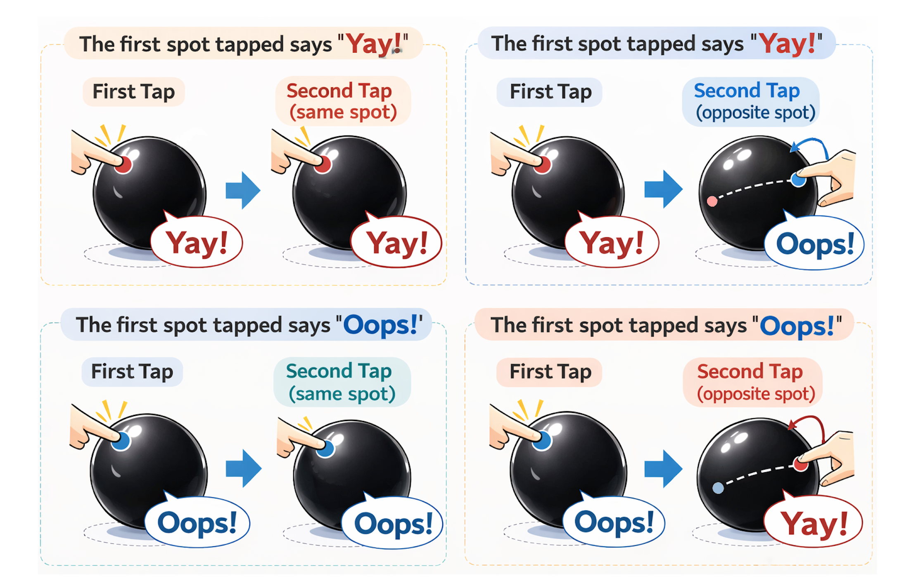
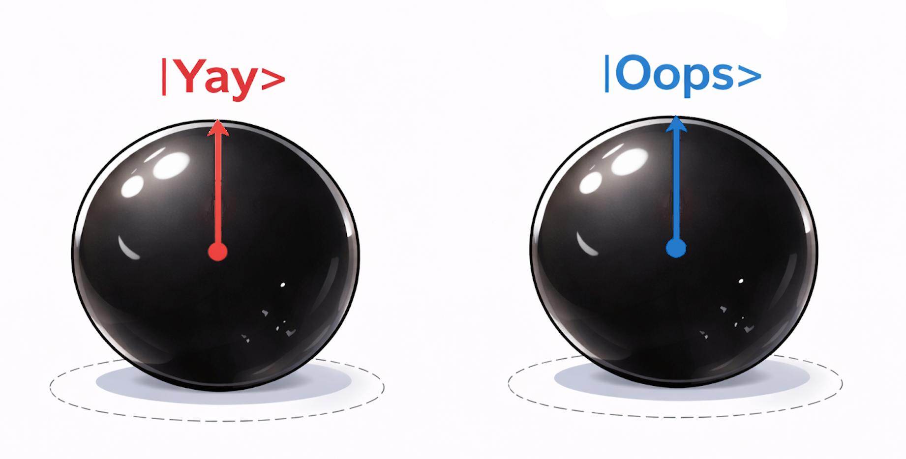
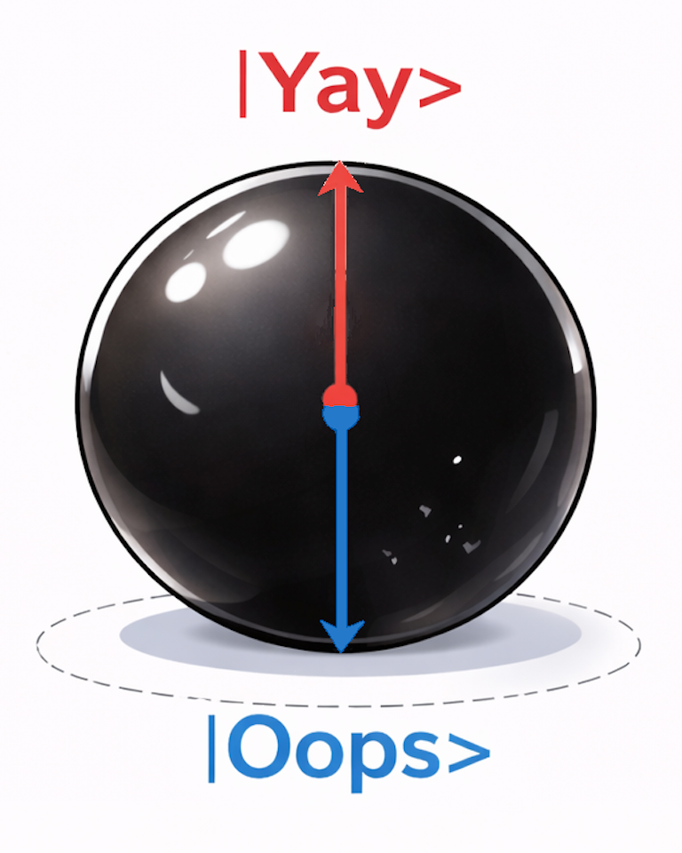

# Chapter 1: The Alien Sphere

## Scene 1-1: 発見

春の光がゆっくり傾きはじめたころ、Aliceはひとりで野原を歩いていた。  
風はやわらかく、草の先がさざ波のように揺れている。いつもの帰り道のはずだった。

けれど、丘をひとつ越えた先で、彼女は足を止める。  
草のあいだに、場違いなほど黒い球が置かれていたからだ。

それはバレーボールほどの大きさで、驚くほど真ん丸だった。  
表面には縫い目も傷も文字もない。光を吸い込むような黒。  
何かの機械にも見えないし、自然物にも見えない。  
まるで「この世界の作り方」を知らない誰かが、試しに置いていったような物体だった。

Aliceはしゃがみこみ、恐る恐る手を伸ばす。  
指先で軽く叩いた瞬間、球は突然叫んだ。

**Yay!**

Aliceは悲鳴を飲みこみ、そのまま後ろにひっくり返った。  
しばらく離れて見つめていたが、球は何事もなかったように草の上で黙っている。

「……今の、聞き間違いじゃないよね」

彼女は深呼吸をひとつして、もう一度そっと叩いた。

**Oops!**

今度は立ったまま跳ねるように後ずさる。  
しかし、怖さと同じくらい強く、好奇心が膨らんでいた。

Aliceは位置を変え、角度を変え、手の甲でつつき、指で軽く叩き、何度も球を叩いた。  
そのたびに球は叫ぶ。  
だが、どれだけ試しても声は二種類しかなかった。

**Yay!**  
**Oops!**

それ以外は、何ひとつ出てこない。

やがてAliceは球を抱え上げた。  
見た目より密度を感じる。軽くはないが、重すぎるわけでもなく、両手なら十分に扱える重さだった。  
こんなものをひとりで抱え込むのは無理だ。  
彼女はまっすぐ、BobとCharlieのところへ向かった。

---

事情を聞いたBobは、最初は笑っていた。  
「しゃべる球？　またまた」  
だが実物を見ると、笑いは一瞬で消えた。

Charlieも黙って球を見下ろす。  
「これ、どこで見つけたの……？」

三人は順番に球を叩いた。  
結果はAliceの話どおりだった。  
球は叩いたときに必ず叫ぶ。だが、言える言葉は二つだけ。

**Yay!**  
**Oops!**

Bobは手を叩く場所を変え、リズムを変え、連打してみせる。  
Charlieは耳を近づけ、爪で軽く弾き、強く叩き、弱く叩く。  
Aliceは球を少し回してから叩く。  
それでも、新しい声は出なかった。

「これ、何の役に立つんだろうね」  
Bobが肩をすくめる。  
Aliceも苦笑いした。  
Charlieだけは、まだ球を見つめていた。

「あれ？」  
Charlieが小さく言った。  
「同じところを二回叩くと、二回目は必ず一回目と同じ声になる」

Aliceはすぐ試した。  
一回叩く。球が叫ぶ。  
次に、ぱっと反対側へ手を回して叩く。すると別の声が出た。

「同じ声にならないじゃん！」

Charlieは首を振る。  
「同じ“ところ”を叩くんだよ。Alice、今は反対側を叩いた」

Aliceは言われたとおり、さっきと同じ場所をもう一度叩く。  
球は、さっきと同じ声で叫んだ。

そのときBobが目を細めた。  
「待って。じゃあさ……」

Bobは球の一点を軽く叩き、出た声を確かめる。  
そして、ほぼ正反対と思われる場所を探し、そこを叩いた。  
球は、今の声とは必ず逆の声で叫んだ。

三人は顔を見合わせる。

偶然ではない。  
気まぐれでもない。  
この球には、見えない規則がある。

Aliceは球を抱えなおした。  
その重みはさっきより増したように感じる。  
ただ質量があるだけではない。  
中に、まだ名前のない法則が詰まっているようだった。

「これ、宇宙人の落とし物かもしれない」  
Bobが半分冗談で言う。  
Charlieは真顔でうなずいた。  
「でも、落とした人より先に、ぼくらがルールを見つけよう」

風が草を揺らし、黒い球は静かにそこにあった。  
次に叩かれる瞬間を待つように。

三人の実験は、ここから始まる。

## Physics Note 1-1: 発見

状況を表に整理しよう。球の表面には印がないので、叩く場所は「任意の場所」になる。
ただし、一度叩くと、その球の内部状態が変わり、同じ場所を叩くと同じ声がする。
一度叩いて、２度目はちょうど真逆の場所を叩くと、逆の声がする。

<table border="1" cellspacing="0" cellpadding="6">
  <thead>
    <tr>
      <th>一回目、叩く場所</th>
      <th>一回目の声</th>
      <th>二回目、叩く場所</th>
      <th>二回目の声</th>
    </tr>
  </thead>
  <tbody>
    <tr>
      <td>球表面の任意の場所</td>
      <td><strong>Yay!</strong></td>
      <td>一回目と同じ場所</td>
      <td><strong>Yay!</strong></td>
    </tr>
    <tr>
      <td>球表面の任意の場所</td>
      <td><strong>Yay!</strong></td>
      <td>一回目と真逆の場所</td>
      <td><strong>Oops!</strong></td>
    </tr>
    <tr>
      <td>球表面の任意の場所</td>
      <td><strong>Oops!</strong></td>
      <td>一回目と同じ場所</td>
      <td><strong>Oops!</strong></td>
    </tr>
    <tr>
      <td>球表面の任意の場所</td>
      <td><strong>Oops!</strong></td>
      <td>一回目と真逆の場所</td>
      <td><strong>Yay!</strong></td>
    </tr>
  </tbody>
</table>

## Scene 1-2: 観測則と状態

Bobは考えた。「一度叩くと、内部の何かの状態が決まる。
ベクトルのようなものを考えると良いのかな？ Yay! と叫んだら

$$
|Yay\rangle
$$

という状態。逆に、Oops! と叫んだら 

$$
|Oops\rangle
$$

という状態になると考えるのはどう？」

Charlie「そう、 $|Yay\rangle$ ベクトルの先端をもう一度叩くと
Yay! と言い、$|Yay\rangle$  ベクトルの始点を叩くと Oops! と言う。
だから、 $|Yay\rangle$  ベクトルと $|Oops\rangle$ ベクトルはちょうど
逆を向くベクトルと言える。」

Alice「えーと、図にするとこんな感じ？」

Bob「そう、叩いた点を必ず一番上にとる座標系を考える。すると一度叩くと、Aliceが描いた２つの状態のどちらかになる」

Charlie「これは固有状態というやつ？」

Bob「そう、この黒い球は２つの固有状態がある。」

Alice「まとめることもできるよ」

Bob「うーん、確かに。一度叩くとつまりこの球の状態になるわけだ」

(注意: この段階の「逆向きベクトル」という言い方は直観モデル。後で厳密な直交の言葉に置き換える。)

Bobはノートの端に新しい記号を書いた。  
「“叩く”を、ただの動詞のままにすると話が進まない。  
どこを叩いたかまで含めて、操作として書こう」

Charlieが続ける。  
「方向 $n$ を叩く測定を、ひとまず $\hat M_n$ と呼ぶのがよさそうだね」

Aliceが確認する。  
「じゃあ、操作は“叩くこと”じゃなくて、“どこを叩くかまで含んだ叩き方”ってこと？」

Bobがうなずく。  
「そう。$n$ が違えば別の測定だ。  
この球の2つの状態が、その測定にどう応答するかを式で書けるはずだ」

## Physics Note 1-2: 観測則と状態

- 測定結果は常に2値: `Yay` または `Oops`

状態記号として

$$
|Yay\rangle,\quad |Oops\rangle
$$

を導入する。
この $|\,\cdot\,\rangle$ の形をケット（ket）、対応する $\langle\,\cdot\,|$ の形をブラ（bra）と呼ぶ。

本書では、特に断らない限り基準軸として $z$ 軸を暗黙に採用する。  
したがって

$$
|Yay\rangle\equiv|Yay_z\rangle,\qquad |Oops\rangle\equiv|Oops_z\rangle
$$

とする。一般方向 $n$ の固有状態は

$$
|Yay_n\rangle,\quad |Oops_n\rangle
$$

と書く。また、$n$ のちょうど180°の方向を $-n$ とする。

$$
\begin{aligned}
|Yay_{-n}\rangle &= |Oops_n\rangle\\
|Oops_{-n}\rangle &= |Yay_n\rangle
\end{aligned}
$$

ここで重要なのは、`逆向きに見える` ことと `同じ状態` であることは別だという点である。  
厳密には、$|Yay_n\rangle$ と $|Oops_n\rangle$ は同一直線上の符号違いではなく、互いに直交する独立状態として扱う。

直交規格化条件:

$$
\langle Yay|Yay\rangle=\langle Oops|Oops\rangle=1,\qquad
\langle Yay|Oops\rangle=0
$$

測定を表す演算子を $\hat M_n$ とする（添字 $n$ は「どこを叩くか」）。  
特に $z$ 方向の測定を $\hat M_z$ と書き、この章では簡単のため $\hat M\equiv\hat M_z$ と省略する。

測定値（固有値）は記号として $a,b$ を使う（実数、かつ $a\neq b$）。

$$
\hat M|Yay\rangle=a|Yay\rangle,\qquad
\hat M|Oops\rangle=b|Oops\rangle
$$

この式の意味は2つある。  
1つ目は、測定 $\hat M$ を行うと、それぞれの状態に対して測定値（固有値）$a,b$ が得られること。  
2つ目は、右辺の状態ベクトルが左辺と同じ $|Yay\rangle,|Oops\rangle$ のままであること、つまり固有状態にある限り測定で状態が変わらないこと。  
したがって同じ場所を続けて叩けば、2度目も同じ測定値（同じ声）が再現される。

## Scene 1-3: 状態の重ね合わせ

Alice「へー。見た目の矢印は便利だけど、そのまま厳密ではないんだね。
ところで、状態ベクトルが縦のとき、横を叩いたらどうなるの？」

Bob「そのために一般の状態を導入する。」

2つの基底状態 $|Yay\rangle, |Oops\rangle$ の混ざり具合を表すため、一般状態を

$$
|\phi\rangle=\alpha|Yay\rangle+\beta|Oops\rangle,\qquad
\alpha,\beta\in\mathbb{R}
$$

と置く。

Alice「なんだかよく分かんない。」

Charlie「とりあえず一回球の頂点を叩くと、 $|Yay_z\rangle$ か $|Oops_z\rangle$ かの
どちらかになる。頂点からθの角度の場所を二回目に叩くと、どちらの声がするか統計取ってみようよ。」

Charlie達は注意深く実験して以下の結果を得た。

- 一回目叩いた点から、 $\theta$ だけズレた点で2回目を叩く。その測定では、経験的に次が成り立つ:

<table border="1" cellspacing="0" cellpadding="6">
  <thead>
    <tr>
      <th>一回目と二回目の声</th>
      <th>一回目と二回目の叩く点の角度 θ</th>
      <th>観測確率</th>
      <th>理論値</th>
    </tr>
  </thead>
  <tbody>
    <tr>
      <td>同じ声</td>
      <td>0</td>
      <td>0.98</td>
      <td>cos²(θ/2) = 1.00</td>
    </tr>
    <tr>
      <td>同じ声</td>
      <td>π/4</td>
      <td>0.86</td>
      <td>cos²(θ/2) ≈ 0.85</td>
    </tr>
    <tr>
      <td>同じ声</td>
      <td>π/2</td>
      <td>0.53</td>
      <td>cos²(θ/2) = 0.50</td>
    </tr>
    <tr>
      <td>同じ声</td>
      <td>3π/4</td>
      <td>0.17</td>
      <td>cos²(θ/2) ≈ 0.15</td>
    </tr>
    <tr>
      <td>同じ声</td>
      <td>π</td>
      <td>0.02</td>
      <td>cos²(θ/2) = 0.00</td>
    </tr>
    <tr>
      <td>異なる声</td>
      <td>0</td>
      <td>0.02</td>
      <td>sin²(θ/2) = 0.00</td>
    </tr>
    <tr>
      <td>異なる声</td>
      <td>π/4</td>
      <td>0.14</td>
      <td>sin²(θ/2) ≈ 0.15</td>
    </tr>
    <tr>
      <td>異なる声</td>
      <td>π/2</td>
      <td>0.47</td>
      <td>sin²(θ/2) = 0.50</td>
    </tr>
    <tr>
      <td>異なる声</td>
      <td>3π/4</td>
      <td>0.83</td>
      <td>sin²(θ/2) ≈ 0.85</td>
    </tr>
    <tr>
      <td>異なる声</td>
      <td>π</td>
      <td>0.98</td>
      <td>sin²(θ/2) = 1.00</td>
    </tr>
  </tbody>
</table>

Alice 「ごちゃごちゃしてきた。」

Bob「でも規則はあるね。これを式に落とし込みたい」

## Physics Note 1-3: 確率と期待値

$\alpha,\beta$ はそれぞれの成分の重みである。  

$$
|\phi\rangle=\alpha|Yay\rangle+\beta|Oops\rangle
$$

正確に書くと

$$
|\phi_n\rangle=\alpha|Yay_n\rangle+\beta|Oops_n\rangle
$$

ここで **要請（ボルン則）** として、測定確率を

$$
P(a)=|\alpha|^2,\qquad P(b)=|\beta|^2
$$

と置く（本章では実係数なので $|\alpha|^2=\alpha^2,\ |\beta|^2=\beta^2$）。  
したがって規格化条件は

$$
\left|\alpha\right|^2+\left|\beta\right|^2=1
$$

この仮定のもとで期待値は

$$
\langle \phi_n | \hat M_n | \phi_n \rangle
=a\left|\alpha\right|^2+b\left|\beta\right|^2
$$

と書ける。

要点:
- 期待値式は「確率解釈」を前提にした結果である。
- 本章では実験事実に合わせてこの規則を採用し、後章でさらに吟味する。

