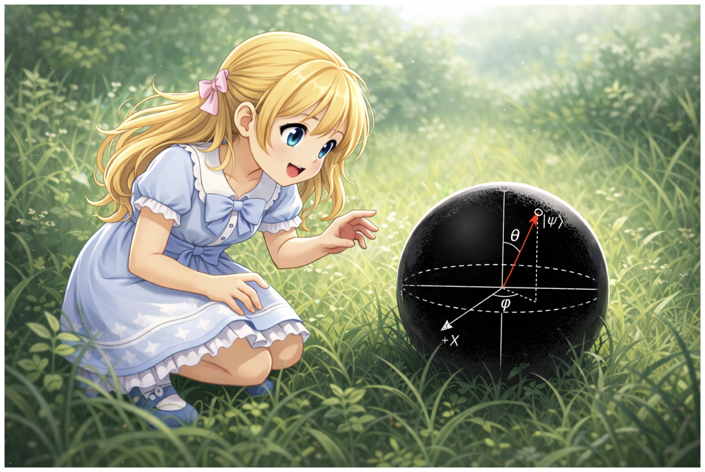

[English](README.md) | [日本語](README-jp.md)

# スピン1/2の物理ノート

シュテルン・ゲルラッハの実験事実から出発し、パウリ行列、回転演算子、ブロッホ球、ベルの不等式までを導く自己完結的なノートシリーズです。

<!-- SEO intro added by setup-github-pages; review and adjust -->

「**パウリ行列** を実験事実からきちんと導きたい」「**ブロッホ球** と **回転演算子** $U(\theta,\mathbf{n}) = \exp(-i\theta \mathbf{n}\cdot\mathbf{J}/\hbar)$ がどう繋がっているのか知りたい」「**ベルの不等式** と **CHSH不等式** を小さくて本物の例で学びたい」 ── そんな人のための **自己完結的な量子力学チュートリアル** です。扱うテーマは **シュテルン・ゲルラッハ実験**、**スペクトル分解**、**射影測定**、**量子もつれ（エンタングルメント）**、そしてスピノル回転を支配する群 **SU(2)** と **SO(3)** のミニ入門など。

<!-- /SEO intro -->

他の教科書を参照しなくても読み進められるよう、式の導出は途中計算を省略せず、新しい概念は使う前に必ず説明しています。厳密さよりわかりやすさを優先しています。

## ノート一覧

| # | タイトル | 内容 |
|---|---------|------|
| 1 | [実験事実からパウリ行列を導く](jp/NOTE1.md) | シュテルン・ゲルラッハ実験の二値測定から固有状態・射影子・スペクトル分解を経てパウリ行列 $\sigma_x, \sigma_y, \sigma_z$ を構成する |
| 2 | [回転演算子の導出](jp/NOTE2.md) | 確率保存とユニタリ性から回転演算子 $U(\theta,\mathbf{n}) = \exp(-i\theta \mathbf{n}\cdot\mathbf{J}/\hbar)$ を導く |
| 3 | [ブロッホ球](jp/NOTE3.md) | スピン状態を球面上の1点として表し、測定確率を幾何学的に読む方法を示す |
| 4 | [なぜ θ/2 が現れるのか](jp/NOTE4.md) | スピン1/2の回転演算子に半角が現れる理由を、角運動量の交換関係から説明する |
| 5 | [ベルの不等式](jp/NOTE5.md) | 2粒子のもつれ状態からCHSH不等式を導き、量子力学が古典的な局所実在論の限界を超えることを示す |
| 補講 | [群論ミニ入門：SU(2) と SO(3)](jp/NOTE6.md) | スピンの回転で登場する群 SU(2) と SO(3) の関係を、群の定義から二重被覆・表現まで簡潔に導入する |

## 前提知識

- 高校レベルの三角関数と行列の基本操作
- 複素数（オイラーの公式 $e^{i\phi} = \cos\phi + i\sin\phi$）
- さわり程度の線形代数、量子論の知識

---

## クレジット

- プロジェクト: t-ishii66（大学で物理を学ぶ。本業はシステムエンジニア）
- 著者: Claude Opus 4.6, t-ishii66
- レビュー: t-ishii66, GPT5.4 Codex
- 英訳: Claude Opus 4.6
- イラスト: ChatGPT5.4
- 公開日: 2026/4/17
- バージョン: 1.0.0

---

**キーワード**: 量子力学 入門 / スピン1/2 / パウリ行列 導出 / シュテルン・ゲルラッハ実験 / ブロッホ球 解説 / 回転演算子 導出 / ベルの不等式 証明 / CHSH不等式 / 量子もつれ エンタングルメント / 固有値 スペクトル分解 / 射影測定 / 隠れた変数 / 局所実在論 / SU(2) / SO(3) / 二重被覆
