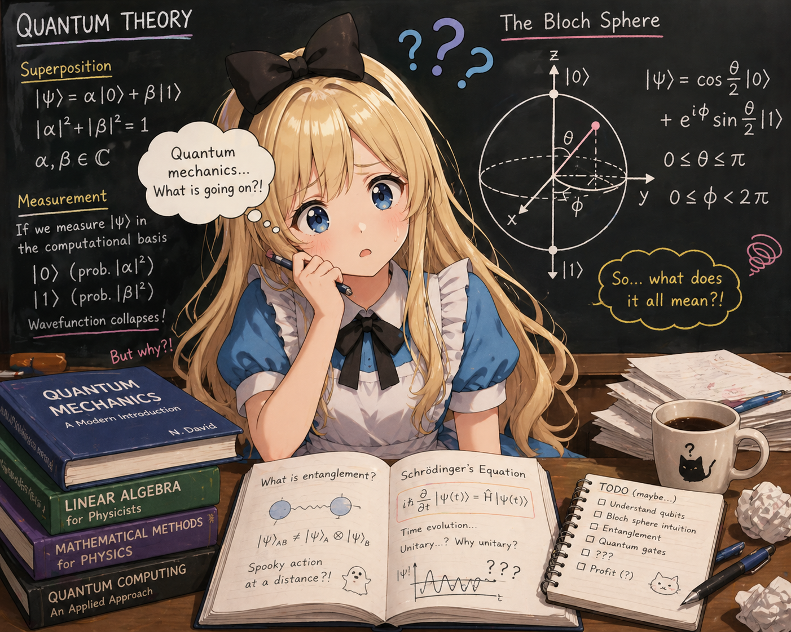

[English](README.md) \| [日本語](README-jp.md)

# Physics Notes on Spin 1/2

A self-contained note series that starts from the experimental facts of the Stern–Gerlach experiment and derives the Pauli matrices, rotation operators, the Bloch sphere, and Bell's inequality.

<!-- SEO intro added by setup-github-pages; review and adjust -->

If you have ever wanted to **derive the Pauli matrices from scratch**, build up **quantum spin 1/2** from real experimental facts, or understand how the **Bloch sphere**, the **rotation operator** $U(\theta,\mathbf{n}) = \exp(-i\theta \mathbf{n}\cdot\mathbf{J}/\hbar)$, and **Bell's inequality** fit together — this **self-contained quantum mechanics tutorial** is for you. Topics covered include the **Stern–Gerlach experiment**, **spectral decomposition**, the **CHSH inequality**, **quantum entanglement**, and a mini introduction to the groups **SU(2)** and **SO(3)** that govern spinor rotations.

<!-- /SEO intro -->

All derivations are presented without skipping intermediate steps, and every new concept is explained before it is used. Clarity is prioritized over rigor.

## Notes

| # | Title | Contents |
|---|-------|----------|
| 1 | [Deriving the Pauli Matrices from Experimental Facts](en/NOTE1.md) | From the two-valued Stern–Gerlach measurement through eigenstates, projectors, and spectral decomposition to construct the Pauli matrices $\sigma_x, \sigma_y, \sigma_z$ |
| 2 | [Derivation of the Rotation Operator](en/NOTE2.md) | Derive the rotation operator $U(\theta,\mathbf{n}) = \exp(-i\theta \mathbf{n}\cdot\mathbf{J}/\hbar)$ from probability conservation and unitarity |
| 3 | [The Bloch Sphere](en/NOTE3.md) | Represent spin states as points on a sphere and read measurement probabilities geometrically |
| 4 | [Why θ/2 Appears](en/NOTE4.md) | Explain why the half-angle appears in the spin-1/2 rotation operator, from angular momentum commutation relations |
| 5 | [Bell's Inequality](en/NOTE5.md) | Derive the CHSH inequality from entangled two-particle states and show that quantum mechanics exceeds the classical local-realist bound |
| Supplement | [Mini Introduction to Group Theory: SU(2) and SO(3)](en/NOTE6.md) | A concise introduction to the groups SU(2) and SO(3) that appear in spin rotations, from group definitions through double covers and representations |

## Prerequisites

- High-school level trigonometry and basic matrix operations
- Complex numbers (Euler's formula $e^{i\phi} = \cos\phi + i\sin\phi$)
- A basic familiarity with linear algebra and quantum theory

---

## Credits

- Project: t-ishii66 (studied physics at university; systems engineer)
- Authors: Claude Opus 4.6, t-ishii66
- Review: t-ishii66, GPT5.4 Codex
- English translation: Claude Opus 4.6
- Illustrations: ChatGPT5.4
- Published: 2026/4/17
- Version: 1.0.0

---

**Keywords**: quantum mechanics tutorial / spin 1/2 / Pauli matrices derivation / Stern-Gerlach experiment / Bloch sphere / rotation operator derivation / Bell inequality proof / CHSH inequality / quantum entanglement / Born rule / eigenvalue equation / spectral decomposition / projective measurement / hidden variables / local realism / SU(2) / SO(3) / double cover

