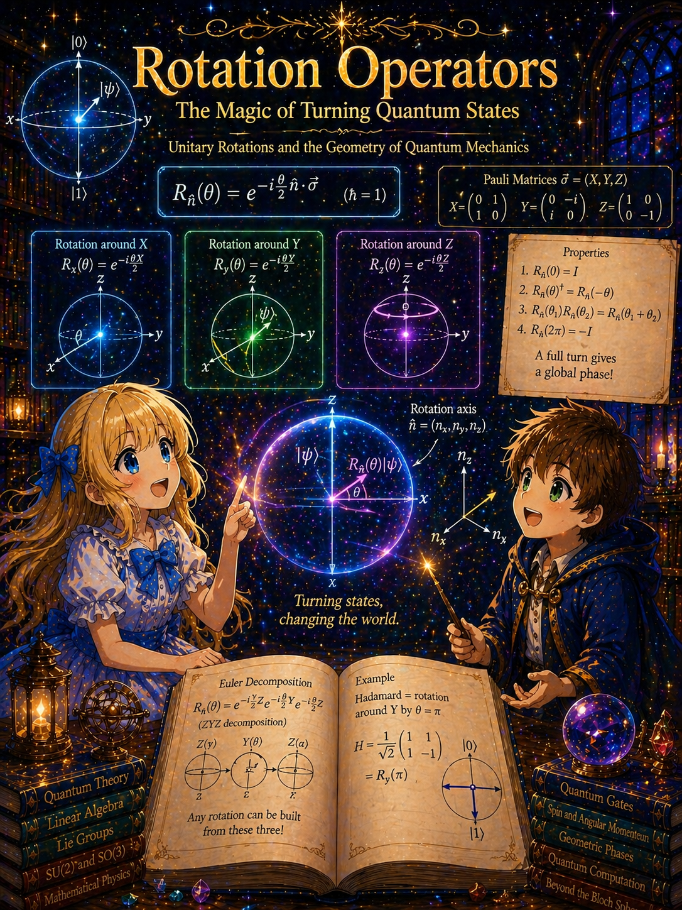

# Derivation of the Rotation Operator $U(\theta,\mathbf{n}) = \exp(-i\theta J_{\mathbf{n}}/\hbar)$



> **Series**: [From Experiments to Pauli Matrices](NOTE1.md) → This document (NOTE2.md) → [The Bloch Sphere](NOTE3.md) → [The Origin of θ/2](NOTE4.md) → [Bell's Inequality](NOTE5.md)

## Purpose of This Document

In [NOTE1.md](NOTE1.md), we derived the Pauli matrices $\sigma_x, \sigma_y, \sigma_z$ from the two-valued measurements of the Stern–Gerlach experiment and confirmed the commutation relation $[\sigma_i, \sigma_j] = 2i\epsilon_{ijk}\sigma_k$.

This document addresses a more general question: why does the quantum-mechanical rotation operator take the form

```math
U(\theta,\mathbf{n})
=
\exp\!\left(
-\frac{i}{\hbar}\,\theta\,\mathbf{n}\cdot\mathbf{J}
\right)
```

We explain this in a single logical flow. Here $\theta$ is the **rotation angle** about the axis $\mathbf{n}$, which is a different quantity from the polar angle of the Bloch sphere (a way of representing spin states as points on a sphere, explained in [NOTE3.md](NOTE3.md)).

The starting assumptions are the following three:

1. Quantum states are represented by vectors
2. Physical observables are represented by Hermitian operators
3. Probability is conserved (the norm of the state vector does not change)

Along the way, we also use standard assumptions for dealing with symmetry transformations, such as the fact that composition of rotations corresponds to products of unitary operators, and that rotations about the same axis form a continuous group. These will be stated as they are used.

---

## Overview

The derivation proceeds in four stages.

1. **A small rotation is "almost nothing"** → We can write $U = I + (\text{something small})$
2. **Probability conservation constrains the form** → That "something" must be of the form $-iG/\hbar$
3. **Accumulating small rotations produces an exponential** → $U = \exp(-i\theta G/\hbar)$
4. **Determining what $G$ is** → The $G$ that correctly generates rotations is the angular momentum

Through these four stages, the form of the rotation operator is determined naturally.

---

## Stage 1: Writing a Small Rotation as a Formula

Consider rotating by a very small angle $\delta\theta$ about the direction $\mathbf{n}$.

This rotation is a transformation that "almost does nothing," so the corresponding operator is close to the identity operator $I$. Therefore

```math
U(\delta\theta) = I + \delta\theta \cdot K + O(\delta\theta^2)
```

Here $K$ is an as-yet-unknown operator, and $O(\delta\theta^2)$ represents corrections of second order and higher in the small angle.

At this stage, there are no constraints on $K$. We will narrow it down in the next stage.

---

## Stage 2: Probability Conservation Determines the Form

In quantum mechanics, the norm of the state vector corresponds to the total probability. Writing the state after rotation as $\vert\phi'\rangle = U\vert\phi\rangle$, the requirement that probability is unchanged by rotation is

```math
\langle\phi'\vert\phi'\rangle = \langle\phi\vert\phi\rangle
```

Expanding the left-hand side gives

```math
\langle\phi'\vert\phi'\rangle = \langle\phi\vert U^\dagger U\vert\phi\rangle
```

For this to equal $\langle\phi\vert\phi\rangle$ for any $\vert\phi\rangle$, we need

```math
U^\dagger U = I
```

An operator $U$ satisfying this condition is called a unitary operator.

Substituting the first-order expression:

```math
(I + \delta\theta\, K^\dagger)(I + \delta\theta\, K) = I
```

Expanding to first order:

```math
I + \delta\theta(K + K^\dagger) + O(\delta\theta^2) = I
```

Therefore

```math
K + K^\dagger = 0
```

That is, $K$ must be **anti-Hermitian** ($\dagger$ denotes the operation of transposing and taking the complex conjugate; an operator satisfying $K^\dagger = -K$ is called anti-Hermitian, while one satisfying $G^\dagger = G$ is called Hermitian).

An anti-Hermitian operator can be written using a Hermitian operator $G$ as

```math
K = -\frac{i}{\hbar}\,G
```

The factor of $\hbar$ is included to give $G$ the same dimensions as angular momentum (since the angle $\delta\theta$ is dimensionless, $\delta\theta \cdot G/\hbar$ is dimensionless overall).

Therefore, an infinitesimal rotation is restricted to the form

<table border="1" align="center"><tr><td markdown="1">

```math
U(\delta\theta) = I - \frac{i}{\hbar}\,\delta\theta\,G + O(\delta\theta^2)
```

</td></tr></table>

where $G$ is a Hermitian operator. What physical quantity $G$ corresponds to will be identified as angular momentum in Stage 4.

---

## Stage 3: Accumulation Produces an Exponential

### Why an Exponential Appears

This is one of the key insights. The exponential does not descend from the sky — it emerges naturally when **the same operation is repeated many times**.

We want to construct a rotation by a finite angle $\theta$. Dividing it into $N$ equal parts:

```math
\delta\theta = \frac{\theta}{N}
```

A rotation by angle $\theta$ is the result of applying a rotation by $\delta\theta$ a total of $N$ times:

```math
U(\theta) = \bigl[U(\delta\theta)\bigr]^N
```

Substituting the result from the previous section:

```math
U(\theta) = \left(I - \frac{i}{\hbar}\frac{\theta}{N}\,G\right)^N
```

Now take $N$ large. Each individual rotation becomes smaller and smaller, and terms of second order and higher vanish. In the limit $N \to \infty$:

```math
U(\theta)
=
\lim_{N\to\infty}
\left(I - \frac{i}{\hbar}\frac{\theta}{N}\,G\right)^N
```

### Comparison with the Ordinary Exponential Function

For an ordinary number $a$,

```math
e^a = \lim_{N\to\infty}\left(1 + \frac{a}{N}\right)^N
```

holds. This is the very definition of the exponential function: the limit of "multiplying $1 + a/N$ together $N$ times" is $e^a$.

Exactly the same form holds for operators. Replacing $a$ with $-i\theta G/\hbar$, we obtain

<table border="1" align="center"><tr><td markdown="1">

```math
U(\theta,\mathbf{n}) = \exp\!\left(-\frac{i}{\hbar}\,\theta\,G_{\mathbf{n}}\right)
```

</td></tr></table>

### Summary So Far

The assumptions used up to this point are just two:

1. An infinitesimal rotation is close to $I$ (expandable to first order)
2. Probability conservation (unitarity)

From these two alone, the exponential form of the rotation operator has emerged.

Only one question remains: **What is $G$?**

---

## Stage 4: Determining the Identity of $G$

### What the Rotation Operator Must Do

The rotation operator $U$ must correctly rotate physical observables.

For example, consider the position operators $\hat{x}, \hat{y}, \hat{z}$. Under a rotation by angle $\delta\phi$ about the $z$-axis, the position operators should transform as

```math
\hat{x} \to \hat{x} - \hat{y}\,\delta\phi, \qquad
\hat{y} \to \hat{y} + \hat{x}\,\delta\phi, \qquad
\hat{z} \to \hat{z}
```

This is just the first-order expansion in the small angle $\delta\phi$ of the classical rotation matrix about the $z$-axis:

```math
R_z(\phi) =
\begin{pmatrix}
\cos\phi & -\sin\phi & 0 \\
\sin\phi & \cos\phi & 0 \\
0 & 0 & 1
\end{pmatrix}
```

expanded as

```math
R_z(\delta\phi) \approx
\begin{pmatrix}
1 & -\delta\phi & 0 \\
\delta\phi & 1 & 0 \\
0 & 0 & 1
\end{pmatrix}
```

### How Operators Transform in Quantum Mechanics

Suppose a rotation changes the state. Let the state before rotation be $\vert \psi\rangle$ and after rotation be $\vert \psi'\rangle$:

```math
\vert \psi'\rangle = U\vert \psi\rangle
```

The expectation value of a physical observable $\hat{A}$ after rotation becomes

```math
\langle\psi'\vert \hat{A}\vert \psi'\rangle
=
\langle\psi\vert U^\dagger \hat{A}\, U\vert \psi\rangle
```

This means "instead of rotating the state, we can replace the operator with $U^\dagger \hat{A}\, U$ and get the same expectation value." Therefore, the transformation of an operator under rotation is

```math
\hat{A} \to U^\dagger \hat{A}\, U
```

Here we are using the convention of "computing the expectation value in the rotated state using the original state" (some textbooks write $U \hat{A}\, U^\dagger$, which just reverses the sign convention but gives the same physics). Substituting the infinitesimal rotation $U = I - (i/\hbar)\delta\phi\,G_z$, first $U^\dagger$ is

```math
U^\dagger = I + \frac{i}{\hbar}\delta\phi\,G_z
```

(since $G_z$ is Hermitian, $-i$ becomes $+i$). Using this:

```math
\begin{aligned}
U^\dagger \hat{A}\, U
&=
\left(I + \frac{i}{\hbar}\delta\phi\,G_z\right)
\hat{A}
\left(I - \frac{i}{\hbar}\delta\phi\,G_z\right) \\
&=
\hat{A}
- \frac{i}{\hbar}\delta\phi\,\hat{A}G_z
+ \frac{i}{\hbar}\delta\phi\,G_z\hat{A}
+ O(\delta\phi^2) \\
&=
\hat{A}
+ \frac{i}{\hbar}\delta\phi\,(G_z\hat{A} - \hat{A}G_z)
+ O(\delta\phi^2) \\
&=
\hat{A} + \frac{i}{\hbar}\delta\phi\,[G_z, \hat{A}]
+ O(\delta\phi^2)
\end{aligned}
```

Therefore, the change in the operator is

```math
\delta\hat{A} = \frac{i}{\hbar}\delta\phi\,[G_z, \hat{A}]
```

### Conditions Imposed on $G_z$

To correctly reproduce rotation about the $z$-axis:

```math
\frac{i}{\hbar}[G_z, \hat{x}] = -\hat{y}, \qquad
\frac{i}{\hbar}[G_z, \hat{y}] = +\hat{x}, \qquad
\frac{i}{\hbar}[G_z, \hat{z}] = 0
```

must hold. Rewriting:

```math
[G_z, \hat{x}] = i\hbar\,\hat{y}, \qquad
[G_z, \hat{y}] = -i\hbar\,\hat{x}, \qquad
[G_z, \hat{z}] = 0
```

### Orbital Angular Momentum Satisfies This Condition

Let us try

```math
\hat{L}_z = \hat{x}\hat{p}_y - \hat{y}\hat{p}_x
```

All we need is the canonical commutation relations:

```math
[\hat{x}, \hat{p}_x] = i\hbar, \qquad
[\hat{x}, \hat{p}_y] = 0, \qquad \text{etc.}
```

Computing explicitly:

```math
[\hat{L}_z, \hat{x}]
= [\hat{x}\hat{p}_y - \hat{y}\hat{p}_x,\, \hat{x}]
= -\hat{y}[\hat{p}_x, \hat{x}]
= -\hat{y}(-i\hbar)
= i\hbar\,\hat{y}
```

Similarly:

```math
[\hat{L}_z, \hat{y}]
= [\hat{x}\hat{p}_y,\, \hat{y}]
= \hat{x}[\hat{p}_y, \hat{y}]
= \hat{x}(-i\hbar)
= -i\hbar\,\hat{x}
```

```math
[\hat{L}_z, \hat{z}] = 0
```

All three conditions are satisfied. Therefore

```math
G_z = \hat{L}_z
```

The same calculation confirms $G_x = \hat{L}_x$ and $G_y = \hat{L}_y$.

### Extension to a General Axis $\mathbf{n}$

So far we have found that the generators for rotations about the $x, y, z$ axes are $\hat{L}_x, \hat{L}_y, \hat{L}_z$ respectively. What about a tilted axis $\mathbf{n}$?

The key is that infinitesimal rotations are linear (first-order) in the angle. An infinitesimal rotation about a general axis $\mathbf{n} = (n_x, n_y, n_z)$ can be written as a superposition of infinitesimal rotations about the coordinate axes.

Classically, an infinitesimal rotation about the $\mathbf{n}$-axis can be written using the cross product as

```math
\delta\mathbf{r} = \delta\theta\,(\mathbf{n}\times\mathbf{r})
```

Expanding in components:

```math
\begin{aligned}
\delta x &= \delta\theta\,(n_y z - n_z y) \\
\delta y &= \delta\theta\,(n_z x - n_x z) \\
\delta z &= \delta\theta\,(n_x y - n_y x)
\end{aligned}
```

Now let us list the results of infinitesimal rotations about each coordinate axis. These are obtained by substituting the unit vectors of the coordinate axes for $\mathbf{n}$ in the cross-product formula above.

About the $x$-axis, with $\mathbf{n} = (1, 0, 0)$:

```math
\delta x = \delta\theta\,(0 \cdot z - 0 \cdot y) = 0, \qquad
\delta y = \delta\theta\,(0 \cdot x - 1 \cdot z) = -z\,\delta\theta, \qquad
\delta z = \delta\theta\,(1 \cdot y - 0 \cdot x) = +y\,\delta\theta
```

About the $y$-axis, with $\mathbf{n} = (0, 1, 0)$:

```math
\delta x = \delta\theta\,(1 \cdot z - 0 \cdot y) = +z\,\delta\theta, \qquad
\delta y = 0, \qquad
\delta z = \delta\theta\,(0 \cdot y - 1 \cdot x) = -x\,\delta\theta
```

About the $z$-axis, with $\mathbf{n} = (0, 0, 1)$:

```math
\delta x = \delta\theta\,(0 \cdot z - 1 \cdot y) = -y\,\delta\theta, \qquad
\delta y = \delta\theta\,(1 \cdot x - 0 \cdot z) = +x\,\delta\theta, \qquad
\delta z = 0
```

The $z$-axis result agrees with $\hat{x} \to \hat{x} - \hat{y}\,\delta\phi$, $\hat{y} \to \hat{y} + \hat{x}\,\delta\phi$ derived from the rotation matrix in the "What the Rotation Operator Must Do" section. Organizing these results into a table provides a clear overview.

|  | $\delta x$ | $\delta y$ | $\delta z$ |
|:---:|:---:|:---:|:---:|
| Generated by $L_x$ | $0$ | $-z\,\delta\theta$ | $+y\,\delta\theta$ |
| Generated by $L_y$ | $+z\,\delta\theta$ | $0$ | $-x\,\delta\theta$ |
| Generated by $L_z$ | $-y\,\delta\theta$ | $+x\,\delta\theta$ | $0$ |

Let us compare each component of the general-axis result with the rows of this table.

For $\delta x$:

```math
\delta x = \delta\theta\,(n_y z - n_z y)
= n_y \underbrace{(+z\,\delta\theta)}_{L_y\text{ row}} + n_z \underbrace{(-y\,\delta\theta)}_{L_z\text{ row}}
```

For $\delta y$:

```math
\delta y = \delta\theta\,(n_z x - n_x z)
= n_z \underbrace{(+x\,\delta\theta)}_{L_z\text{ row}} + n_x \underbrace{(-z\,\delta\theta)}_{L_x\text{ row}}
```

For $\delta z$:

```math
\delta z = \delta\theta\,(n_x y - n_y x)
= n_x \underbrace{(+y\,\delta\theta)}_{L_x\text{ row}} + n_y \underbrace{(-x\,\delta\theta)}_{L_y\text{ row}}
```

In all three cases, the result is the sum of the $L_x$ row weighted by $n_x$, the $L_y$ row weighted by $n_y$, and the $L_z$ row weighted by $n_z$ (terms where the corresponding table entry is $0$ vanish).

In other words, the infinitesimal rotation about a general axis decomposes, using the rows of the table directly, as

```math
\begin{pmatrix} \delta x \\ \delta y \\ \delta z \end{pmatrix}
=
n_x
\underbrace{
\begin{pmatrix} 0 \\ -z \\ +y \end{pmatrix}
}_{L_x\text{ row}}
\delta\theta
\;+\;
n_y
\underbrace{
\begin{pmatrix} +z \\ 0 \\ -x \end{pmatrix}
}_{L_y\text{ row}}
\delta\theta
\;+\;
n_z
\underbrace{
\begin{pmatrix} -y \\ +x \\ 0 \end{pmatrix}
}_{L_z\text{ row}}
\delta\theta
```

Now, in quantum mechanics the change in an operator is given by

```math
\delta\hat{A} = \frac{i}{\hbar}\delta\theta\,[G_{\mathbf{n}},\, \hat{A}]
```

as we saw earlier. Here $\hat{A}$ is the operator whose change we wish to examine, and we substitute the position components $\hat{x}, \hat{y}, \hat{z}$ one at a time. For the $z$-axis, $G_z = \hat{L}_z$, and substituting $\hat{A} = \hat{x}$ gives $[\hat{L}_z, \hat{x}]$ determining $\delta\hat{x}$, while $\hat{A} = \hat{y}$ gives $[\hat{L}_z, \hat{y}]$ determining $\delta\hat{y}$. The same applied for rotations about the $x$- and $y$-axes.

The decomposition above says "the change for a general axis = the weighted sum of each axis's change with weights $n_x, n_y, n_z$." We want to reproduce this for each of $\hat{A} = \hat{x}, \hat{y}, \hat{z}$. Since the commutator is linear in its first argument:

```math
[n_x\hat{L}_x + n_y\hat{L}_y + n_z\hat{L}_z,\, \hat{A}]
=
n_x[\hat{L}_x, \hat{A}] + n_y[\hat{L}_y, \hat{A}] + n_z[\hat{L}_z, \hat{A}]
```

The right-hand side is exactly the superposition of each axis's contribution weighted by $n_x, n_y, n_z$. Therefore, setting

```math
G_{\mathbf{n}} = n_x\hat{L}_x + n_y\hat{L}_y + n_z\hat{L}_z = \mathbf{n}\cdot\hat{\mathbf{L}}
```

reproduces the decomposition above.

Note: This linear superposition works because we are dealing with infinitesimal rotations (first-order terms only). Finite-angle rotations are generally non-commutative (for example, rotating 90 degrees about the $x$-axis followed by 90 degrees about the $z$-axis gives a different result from the reverse order), and cannot be decomposed by simple addition.

### Angular Momentum as the Generator of Rotations

From the discussion so far, the rotation generator for a particle with position and momentum is the orbital angular momentum $\hat{\mathbf{L}}$. Writing the rotation generator in general as $\mathbf{J}$, we can summarize the results.

**Change in an operator under infinitesimal rotation** — Substituting $G_{\mathbf{n}} = \mathbf{n}\cdot\mathbf{J}$ into the $\delta\hat{A}$ formula from earlier:

```math
\delta\hat{A} = \frac{i}{\hbar}\,\delta\theta\,[\mathbf{n}\cdot\mathbf{J},\, \hat{A}]
```

That is, how an operator $\hat{A}$ changes under rotation is determined entirely by its commutation relation with the generator $\mathbf{J}$.

Here, any scalar operator (an operator with a single component) can be substituted for $\hat{A}$. For a vector operator such as $\hat{\mathbf{r}} = (\hat{x}, \hat{y}, \hat{z})$ with three components, one simply applies this formula to each component separately:

```math
\delta\hat{x} = \frac{i}{\hbar}\,\delta\theta\,[\mathbf{n}\cdot\mathbf{J},\, \hat{x}], \quad
\delta\hat{y} = \frac{i}{\hbar}\,\delta\theta\,[\mathbf{n}\cdot\mathbf{J},\, \hat{y}], \quad
\delta\hat{z} = \frac{i}{\hbar}\,\delta\theta\,[\mathbf{n}\cdot\mathbf{J},\, \hat{z}]
```

These three equations can also be written collectively in vector notation as

```math
\delta\hat{\mathbf{r}} = \frac{i}{\hbar}\,\delta\theta\,[\mathbf{n}\cdot\mathbf{J},\, \hat{\mathbf{r}}]
```

(where the commutator on the right-hand side is understood component by component). In fact, throughout the preceding discussion, computing $[\hat{L}_z, \hat{x}]$ and $[\hat{L}_z, \hat{y}]$ to determine $\delta\hat{x}$ and $\delta\hat{y}$ for rotation about the $z$-axis was nothing other than performing this "component-by-component substitution."

**Finite rotation** — Accumulating these infinitesimal rotations up to angle $\theta$, the unitary operator that rotates state vectors is

<table border="1" align="center"><tr><td markdown="1">

```math
U(\theta,\mathbf{n}) = \exp\!\left(-\frac{i}{\hbar}\,\theta\,\mathbf{n}\cdot\mathbf{J}\right)
```

</td></tr></table>

The transformation of an operator $\hat{A}$ itself under a finite rotation is given by

```math
\hat{A} \;\longrightarrow\; U^{\dagger}(\theta,\mathbf{n})\,\hat{A}\,U(\theta,\mathbf{n})
```

Whether one rotates the state by $U$ or inversely rotates the operator by $U^{\dagger}\hat{A}\,U$ is simply viewing the same physics from opposite sides.

---

## Application to Spin 1/2

When considering purely spin degrees of freedom, for spin 1/2:

```math
\mathbf{J} = \mathbf{S} = \frac{\hbar}{2}\boldsymbol{\sigma}
```

so

```math
U(\theta,\mathbf{n})
=
\exp\!\left(-i\frac{\theta}{2}\,\mathbf{n}\cdot\boldsymbol{\sigma}\right)
```

The $\hbar$ cancels, and the half-angle $\theta/2$ appears. Why $\theta/2$ emerges and what its physical meaning is — that is the subject of the next document, [NOTE4.md](NOTE4.md).

---

## Logical Structure (Review)

```
A small rotation is close to I
    ↓
Probability conservation → U = I − (i/ℏ)δθ G  (G is Hermitian)
    ↓
Accumulating N small rotations → U = exp(−iθG/ℏ)
    ↓
What is G? → Impose the condition that it correctly rotates operators
    ↓
Position operator transformation: δ = (i/ℏ)δθ [G, Â]
    ↓
z-axis rotation requirements: [G_z, x̂] = iℏ ŷ,  [G_z, ŷ] = −iℏ x̂
    ↓
L_z = x̂p̂_y − ŷp̂_x satisfies these → G = angular momentum
    ↓
U(θ,n) = exp(−iθ n·J/ℏ)
```

Once the framework of symmetry transformations in quantum mechanics is accepted, each step follows naturally from the previous one, and the exponential form of the rotation operator is derived.

---

**Next document**: [NOTE3.md — The Bloch Sphere](NOTE3.md) introduces a method for visualizing spin states as points on a sphere.
