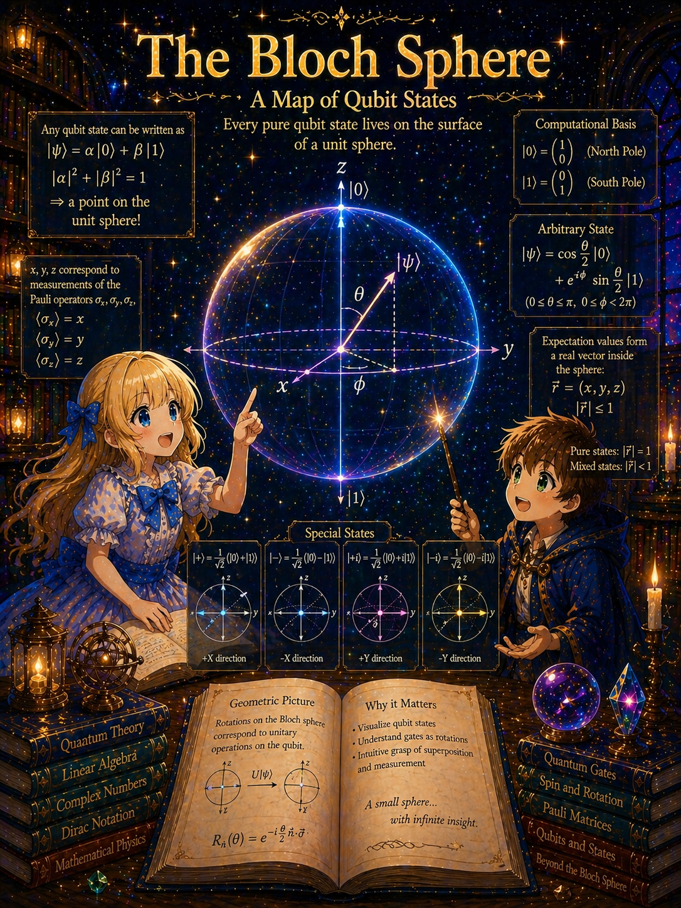
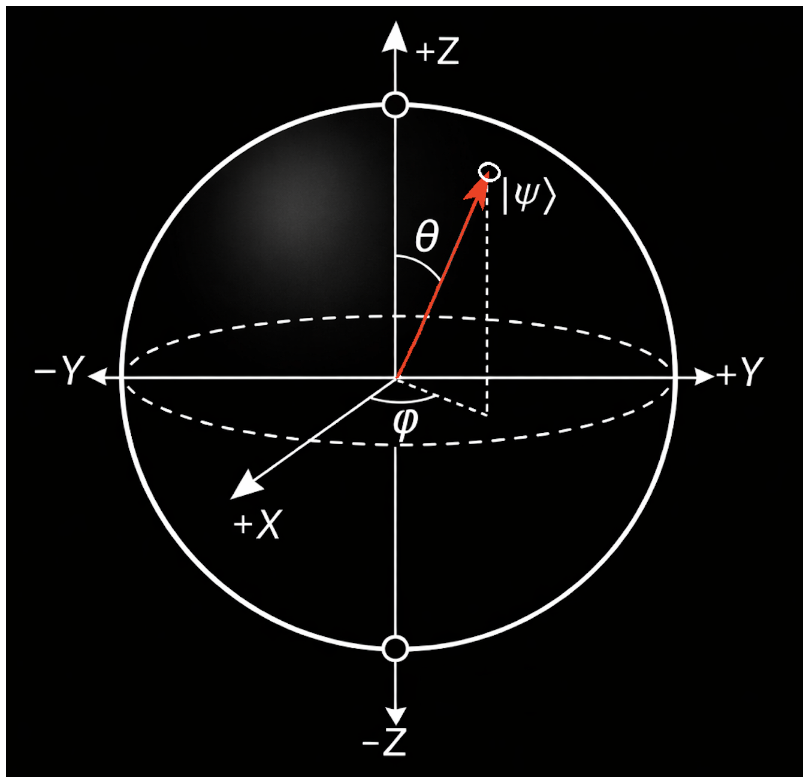

# The Bloch Sphere: Visualizing Spin States on a Sphere



> **Series**: [From Experiments to Pauli Matrices](NOTE1.md) → [Rotation Operators](NOTE2.md) → This document (NOTE3.md) → [The Origin of θ/2](NOTE4.md) → [Bell's Inequality](NOTE5.md)

## Purpose of This Document

In [NOTE1.md](NOTE1.md), we saw that a spin-1/2 state can be written as

```math
\vert \psi\rangle = \alpha\vert {+z}\rangle + \beta\vert {-z}\rangle
```

and that the relative phase $\phi$ has physical meaning. We also obtained the result that $\phi = 0$ corresponds to the $x$-direction and $\phi = \pi/2$ to the $y$-direction.

In this document, we introduce a method for representing an arbitrary spin state as **a single point on a sphere** — the Bloch sphere. The Bloch sphere is not merely a visual aid; it is a compact representation of spin-1/2 physics from which measurement probabilities, orthogonality of states, and the effects of rotation can all be read off geometrically.

---

## Overview

The derivation proceeds in four stages.

1. **Parametrize a general state** → It can be written with two real parameters (polar angle and azimuthal angle)
2. **Map to a point on a sphere** → Definition of the Bloch sphere
3. **Read measurement probabilities geometrically** → Relation between inner products and angles on the sphere
4. **Confirm the meaning of special points** → North pole, south pole, equator, antipodal points

---

## Stage 1: Writing the State with Two Angles

### Starting Point

The general state of spin 1/2 is

```math
\vert \psi\rangle = \alpha\vert {+z}\rangle + \beta\vert {-z}\rangle
```

satisfying the normalization condition $\vert \alpha\vert ^2 + \vert \beta\vert ^2 = 1$. Since $\alpha, \beta$ are complex numbers, there are four real parameters (the real and imaginary parts of each).

### Removing the Overall Phase

In quantum mechanics, multiplying the entire state vector by a common phase $e^{i\gamma}$ does not change the physics. This is because all measurement probabilities are computed as $\vert \langle\phi\vert \psi\rangle\vert ^2$, and the overall phase cancels in the absolute value squared.

Using this freedom, we can choose $\alpha$ to be real and non-negative. Then $\alpha = \vert \alpha\vert$, and from the normalization condition $\alpha^2 + \vert \beta\vert ^2 = 1$, both $\alpha$ and $\vert \beta\vert$ are determined by a single parameter.

Specifically, using an angle $\theta$ ($0 \leq \theta \leq \pi$):

```math
\alpha = \cos\frac{\theta}{2}, \qquad \vert \beta\vert  = \sin\frac{\theta}{2}
```

The normalization condition $\cos^2(\theta/2) + \sin^2(\theta/2) = 1$ is automatically satisfied.

### Why $\theta/2$?

Why use $\theta/2$ rather than $\theta$? Of course one could write $\cos\eta$, $\sin\eta$ and set $\eta = \theta/2$, but there is a physical reason for writing $\theta$. To see this, let us find the eigenstate corresponding to measurement along a general spatial direction $\mathbf{n}$.

#### Measurement Operator for a General Direction

In [NOTE1.md](NOTE1.md) we derived the Pauli matrices $\sigma_z, \sigma_x, \sigma_y$ as the measurement operators for the $z$, $x$, $y$ directions. The measurement operator for a general direction $\mathbf{n} = (n_x, n_y, n_z)$ is the linear combination

```math
\mathbf{n}\cdot\boldsymbol{\sigma}
= n_x\sigma_x + n_y\sigma_y + n_z\sigma_z
= \begin{pmatrix} n_z & n_x - in_y \\ n_x + in_y & -n_z \end{pmatrix}
```

Writing the direction $\mathbf{n}$ in polar coordinates as $n_x = \sin\theta\cos\phi$, $n_y = \sin\theta\sin\phi$, $n_z = \cos\theta$, the diagonal entries become $\pm\cos\theta$. The off-diagonal entries are

```math
n_x + in_y = \sin\theta\cos\phi + i\sin\theta\sin\phi = \sin\theta(\cos\phi + i\sin\phi) = \sin\theta\,e^{i\phi}
```

and the other is the complex conjugate:

```math
n_x - in_y = \sin\theta\,e^{-i\phi}
```

In the last step we used Euler's formula $e^{i\phi} = \cos\phi + i\sin\phi$. Summarizing:

```math
\mathbf{n}\cdot\boldsymbol{\sigma}
= \begin{pmatrix} \cos\theta & \sin\theta\,e^{-i\phi} \\ \sin\theta\,e^{i\phi} & -\cos\theta \end{pmatrix}
```

#### Finding the Eigenstates

We seek the eigenstate belonging to eigenvalue $+1$ of this matrix. Setting

```math
\vert {+n}\rangle = \begin{pmatrix} a \\ b \end{pmatrix}
```

the eigenvalue equation is

```math
(\mathbf{n}\cdot\boldsymbol{\sigma})\vert {+n}\rangle = (+1)\vert {+n}\rangle
```

that is,

```math
\begin{pmatrix} \cos\theta & \sin\theta\,e^{-i\phi} \\ \sin\theta\,e^{i\phi} & -\cos\theta \end{pmatrix}
\begin{pmatrix} a \\ b \end{pmatrix}
=
\begin{pmatrix} a \\ b \end{pmatrix}
```

The first row gives

```math
\cos\theta \cdot a + \sin\theta\,e^{-i\phi} \cdot b = a
```

Rearranging:

```math
\sin\theta\,e^{-i\phi} \cdot b = (1 - \cos\theta)\,a
```

Using the half-angle formulas:

```math
1 - \cos\theta = 2\sin^2\frac{\theta}{2}, \qquad
\sin\theta = 2\sin\frac{\theta}{2}\cos\frac{\theta}{2}
```

Substituting:

```math
2\sin\frac{\theta}{2}\cos\frac{\theta}{2}\,e^{-i\phi} \cdot b
= 2\sin^2\frac{\theta}{2} \cdot a
```

Dividing both sides by $2\sin(\theta/2)$ (the case $\theta = 0$ is checked separately below):

```math
\cos\frac{\theta}{2}\,e^{-i\phi} \cdot b = \sin\frac{\theta}{2} \cdot a
```

Therefore the ratio of $a$ to $b$ is

```math
\frac{b}{a} = \frac{\sin(\theta/2)}{\cos(\theta/2)}\,e^{i\phi}
```

Using the normalization $\vert a\vert ^2 + \vert b\vert ^2 = 1$ and the freedom to choose $a$ real and non-negative:

```math
a = \cos\frac{\theta}{2}, \qquad b = e^{i\phi}\sin\frac{\theta}{2}
```

That is,

```math
\vert {+n}\rangle = \cos\frac{\theta}{2}\vert {+z}\rangle + e^{i\phi}\sin\frac{\theta}{2}\vert {-z}\rangle
```

#### Consistency with Known Results

Let us verify this agrees with the special cases found in [NOTE1.md](NOTE1.md).

- **$z$-direction** ($\theta = 0$): $\cos 0 = 1$, $\sin 0 = 0$, so $\vert {+n}\rangle = \vert {+z}\rangle$ $\checkmark$
- **$x$-direction** ($\theta = \pi/2$, $\phi = 0$): $\cos(\pi/4) = \sin(\pi/4) = 1/\sqrt{2}$, $e^{i\cdot 0} = 1$, so $\vert {+n}\rangle = \frac{1}{\sqrt{2}}(\vert {+z}\rangle + \vert {-z}\rangle) = \vert {+x}\rangle$ $\checkmark$
- **$y$-direction** ($\theta = \pi/2$, $\phi = \pi/2$): $e^{i\pi/2} = i$, so $\vert {+n}\rangle = \frac{1}{\sqrt{2}}(\vert {+z}\rangle + i\vert {-z}\rangle) = \vert {+y}\rangle$ $\checkmark$

#### The Meaning of $\theta/2$ and Connection to $(\alpha, \beta)$

We have thus found that **when the spatial direction makes angle $\theta$, the state vector coefficients contain $\theta/2$**. This is not a coincidence but a consequence that follows necessarily from the mathematical structure of spin 1/2 (discussed in detail in [NOTE4.md](NOTE4.md)).

Let us return to the starting point. In the "Removing the Overall Phase" section, we set $\alpha = \cos(\theta/2)$, $\vert \beta\vert = \sin(\theta/2)$. Now, the derivation of the eigenstate has also given us $b = e^{i\phi}\sin(\theta/2)$. This provides the complete form of $\beta$ — its magnitude is $\sin(\theta/2)$ and its phase is $e^{i\phi}$. That is,

```math
\alpha = \cos\frac{\theta}{2}, \qquad \beta = e^{i\phi}\sin\frac{\theta}{2}
```

Here $\phi$ ($0 \leq \phi < 2\pi$) is the **relative phase** of the two components, and $\theta$ and $\phi$ correspond to the polar angle and azimuthal angle of the direction $\mathbf{n}$, respectively.

### Standard Form

Summarizing the above: since varying the direction $\mathbf{n}$ freely in the expression for the eigenstate $\vert {+n}\rangle$ yields any state, we rename $\vert {+n}\rangle$ as $\vert \psi\rangle$. After removing the overall phase freedom, the general state of spin 1/2 is

<table border="1" align="center"><tr><td markdown="1">

```math
\vert \psi\rangle = \cos\frac{\theta}{2}\vert {+z}\rangle + e^{i\phi}\sin\frac{\theta}{2}\vert {-z}\rangle
```

</td></tr></table>

written with **just two real parameters $(\theta, \phi)$**.

- $\theta$: ranges from $0$ to $\pi$ (determines the ratio of the $\vert {+z}\rangle$ and $\vert {-z}\rangle$ components)
- $\phi$: ranges from $0$ to $2\pi$ (determines the relative phase of the two components)



---

## Stage 2: Mapping to a Point on the Sphere

### Two Angles → One Point on a Sphere

$(\theta, \phi)$ has exactly the same form as the polar coordinates (polar angle and azimuthal angle) of a sphere.

- $\theta = 0$: north pole
- $\theta = \pi$: south pole
- $0 < \theta < \pi$: somewhere between the north and south poles
- $\phi$: azimuthal direction in the equatorial plane

Using this correspondence directly, the representation of a spin state as a single point on a unit sphere is the **Bloch sphere**.

### The Bloch Vector

A point on the sphere can be represented by a unit vector from the origin to the surface. This vector is called the **Bloch vector** $\mathbf{r}$. In Cartesian coordinates:

```math
\mathbf{r} = \begin{pmatrix} \sin\theta\cos\phi \\ \sin\theta\sin\phi \\ \cos\theta \end{pmatrix}
```

This is a unit vector, satisfying $\vert \mathbf{r}\vert  = 1$.

### Correspondence Table

| State | $\theta$ | $\phi$ | Bloch vector | Position on sphere |
|:---:|:---:|:---:|:---:|:---:|
| $\vert {+z}\rangle$ | $0$ | — | $(0, 0, 1)$ | North pole |
| $\vert {-z}\rangle$ | $\pi$ | — | $(0, 0, -1)$ | South pole |
| $\vert {+x}\rangle$ | $\pi/2$ | $0$ | $(1, 0, 0)$ | Equator, $x$-direction |
| $\vert {-x}\rangle$ | $\pi/2$ | $\pi$ | $(-1, 0, 0)$ | Equator, $-x$-direction |
| $\vert {+y}\rangle$ | $\pi/2$ | $\pi/2$ | $(0, 1, 0)$ | Equator, $y$-direction |
| $\vert {-y}\rangle$ | $\pi/2$ | $3\pi/2$ | $(0, -1, 0)$ | Equator, $-y$-direction |

### Verification

Let us check against the eigenstates derived in [NOTE1.md](NOTE1.md).

$\vert {+x}\rangle$: Substituting $\theta = \pi/2$, $\phi = 0$ into the standard form:

```math
\cos\frac{\pi/2}{2}\vert {+z}\rangle + e^{i \cdot 0}\sin\frac{\pi/2}{2}\vert {-z}\rangle
= \cos\frac{\pi}{4}\vert {+z}\rangle + \sin\frac{\pi}{4}\vert {-z}\rangle
= \frac{1}{\sqrt{2}}(\vert {+z}\rangle + \vert {-z}\rangle)
```

This agrees with $\vert {+x}\rangle$ from [NOTE1.md](NOTE1.md). $\checkmark$

$\vert {+y}\rangle$: Substituting $\theta = \pi/2$, $\phi = \pi/2$:

```math
\frac{1}{\sqrt{2}}(\vert {+z}\rangle + e^{i\pi/2}\vert {-z}\rangle)
= \frac{1}{\sqrt{2}}(\vert {+z}\rangle + i\vert {-z}\rangle)
```

This also agrees with $\vert {+y}\rangle$ from [NOTE1.md](NOTE1.md). $\checkmark$

$\vert {-x}\rangle$: Substituting $\theta = \pi/2$, $\phi = \pi$:

```math
\frac{1}{\sqrt{2}}(\vert {+z}\rangle + e^{i\pi}\vert {-z}\rangle)
= \frac{1}{\sqrt{2}}(\vert {+z}\rangle - \vert {-z}\rangle)
```

Matches. $\checkmark$

In other words, the convention in [NOTE1.md](NOTE1.md) of "assigning $\phi = 0$ to $x$ and $\phi = \pi/2$ to $y$" translates, in the language of the Bloch sphere, to "the azimuthal angle on the equator corresponds directly to the spatial azimuthal angle."

---

## Stage 3: Reading Measurement Probabilities on the Sphere

Here we shift perspective. In Stage 1, we wrote the eigenstate $\vert {+n}\rangle$ for an arbitrary direction as $\vert \psi\rangle$. The next question is: "If we perform a spin measurement along **a different direction $\mathbf{n}$ independent of $\vert \psi\rangle$**, what happens?" Here $\mathbf{n}$ is the orientation of the measurement apparatus, which can be chosen freely regardless of the state $\vert \psi\rangle$.

To distinguish the two directions, we henceforth write the angles of $\vert \psi\rangle$ as $(\theta_r, \phi_r)$ and the angles of the measurement direction $\vert {+n}\rangle$ as $(\theta_n, \phi_n)$.

### Review of the Born Rule

For a state $\vert \psi\rangle$, the probability of getting $+1$ in a spin measurement along direction $\mathbf{n}$ is

```math
P(+\mathbf{n}) = \vert \langle{+n}\vert \psi\rangle\vert ^2
```

### Computing the Inner Product

Let the Bloch vector of $\vert \psi\rangle$ be $\mathbf{r}$ and the Bloch vector of the direction $\mathbf{n}$ be $\mathbf{n}$ ($\vert {+n}\rangle$ is the state corresponding to the north pole of a Bloch sphere whose north pole is at $\mathbf{n}$).

Writing $\vert \psi\rangle$ and $\vert {+n}\rangle$ in standard form:

```math
\vert \psi\rangle = \cos\frac{\theta_r}{2}\vert {+z}\rangle + e^{i\phi_r}\sin\frac{\theta_r}{2}\vert {-z}\rangle
```

```math
\vert {+n}\rangle = \cos\frac{\theta_n}{2}\vert {+z}\rangle + e^{i\phi_n}\sin\frac{\theta_n}{2}\vert {-z}\rangle
```

Computing the inner product:

```math
\langle{+n}\vert \psi\rangle = \cos\frac{\theta_n}{2}\cos\frac{\theta_r}{2} + e^{i(\phi_r - \phi_n)}\sin\frac{\theta_n}{2}\sin\frac{\theta_r}{2}
```

We take the squared absolute value. Setting $\Delta\phi = \phi_r - \phi_n$ and introducing the abbreviations

```math
A = \cos\frac{\theta_n}{2}\cos\frac{\theta_r}{2}, \qquad
B = \sin\frac{\theta_n}{2}\sin\frac{\theta_r}{2}
```

the inner product is $\langle{+n}\vert \psi\rangle = A + e^{i\Delta\phi}B$. Its squared absolute value is

```math
\vert A + e^{i\Delta\phi}B\vert ^2
= (A + e^{i\Delta\phi}B)(A + e^{-i\Delta\phi}B)
```

Since $A, B$ are real, $A^* = A$, $B^* = B$, and expanding:

```math
= A^2 + AB\,e^{-i\Delta\phi} + AB\,e^{i\Delta\phi} + B^2
= A^2 + B^2 + AB(e^{i\Delta\phi} + e^{-i\Delta\phi})
```

By Euler's formula, $e^{i\Delta\phi} + e^{-i\Delta\phi} = 2\cos\Delta\phi$, so

```math
= A^2 + B^2 + 2AB\cos\Delta\phi
```

Restoring $A, B$:

```math
\vert \langle{+n}\vert \psi\rangle\vert ^2
= \cos^2\frac{\theta_n}{2}\cos^2\frac{\theta_r}{2} + \sin^2\frac{\theta_n}{2}\sin^2\frac{\theta_r}{2} + 2\cos\frac{\theta_n}{2}\cos\frac{\theta_r}{2}\sin\frac{\theta_n}{2}\sin\frac{\theta_r}{2}\cos\Delta\phi
```

### Inner Product of Bloch Vectors

Now let us find the inner product of the two Bloch vectors $\mathbf{r}$ and $\mathbf{n}$. In spherical coordinates, the Cartesian components of each vector are

```math
\mathbf{r} = \begin{pmatrix} \sin\theta_r\cos\phi_r \\ \sin\theta_r\sin\phi_r \\ \cos\theta_r \end{pmatrix}, \qquad
\mathbf{n} = \begin{pmatrix} \sin\theta_n\cos\phi_n \\ \sin\theta_n\sin\phi_n \\ \cos\theta_n \end{pmatrix}
```

so the inner product is the sum of the products of corresponding components:

```math
\mathbf{r}\cdot\mathbf{n}
= \sin\theta_r\cos\phi_r\sin\theta_n\cos\phi_n
+ \sin\theta_r\sin\phi_r\sin\theta_n\sin\phi_n
+ \cos\theta_r\cos\theta_n
```

Combining the first and second terms:

```math
= \sin\theta_r\sin\theta_n(\cos\phi_r\cos\phi_n + \sin\phi_r\sin\phi_n) + \cos\theta_r\cos\theta_n
```

The expression in parentheses is exactly the cosine addition formula $\cos(\alpha - \beta) = \cos\alpha\cos\beta + \sin\alpha\sin\beta$, so

```math
\mathbf{r}\cdot\mathbf{n} = \sin\theta_r\sin\theta_n\cos\Delta\phi + \cos\theta_r\cos\theta_n
```

Letting $\Theta$ be the angle between the Bloch vectors, $\mathbf{r}\cdot\mathbf{n} = \cos\Theta$, so

```math
\cos\Theta = \sin\theta_r\sin\theta_n\cos\Delta\phi + \cos\theta_r\cos\theta_n
```

### Connecting the Two Expressions

We express the Born rule result (with $A, B$ restored) in terms of $\cos\Theta$ using half-angle formulas. The formulas we use are

```math
\cos^2\frac{x}{2} = \frac{1 + \cos x}{2}, \qquad
\sin^2\frac{x}{2} = \frac{1 - \cos x}{2}, \qquad
\sin x = 2\sin\frac{x}{2}\cos\frac{x}{2}
```

We transform each term of the Born rule expression.

**Term 1:**

```math
\cos^2\frac{\theta_n}{2}\cos^2\frac{\theta_r}{2}
= \frac{1 + \cos\theta_n}{2}\cdot\frac{1 + \cos\theta_r}{2}
= \frac{1 + \cos\theta_n + \cos\theta_r + \cos\theta_n\cos\theta_r}{4}
```

**Term 2:**

```math
\sin^2\frac{\theta_n}{2}\sin^2\frac{\theta_r}{2}
= \frac{1 - \cos\theta_n}{2}\cdot\frac{1 - \cos\theta_r}{2}
= \frac{1 - \cos\theta_n - \cos\theta_r + \cos\theta_n\cos\theta_r}{4}
```

**Term 1 + Term 2:**

```math
= \frac{2 + 2\cos\theta_n\cos\theta_r}{4}
= \frac{1 + \cos\theta_n\cos\theta_r}{2}
```

**Term 3:**

```math
2\cos\frac{\theta_n}{2}\sin\frac{\theta_n}{2}\cos\frac{\theta_r}{2}\sin\frac{\theta_r}{2}\cos\Delta\phi
= \frac{\sin\theta_n\cdot\sin\theta_r}{2}\cos\Delta\phi
```

**Adding everything:**

```math
\vert \langle{+n}\vert \psi\rangle\vert ^2
= \frac{1 + \cos\theta_n\cos\theta_r + \sin\theta_n\sin\theta_r\cos\Delta\phi}{2}
= \frac{1 + \cos\Theta}{2}
= \cos^2\frac{\Theta}{2}
```

In the last step we used the half-angle formula in reverse. $\Theta$ is the angle (central angle) between two points on the Bloch sphere.

### The Probability Formula

<table border="1" align="center"><tr><td markdown="1">

```math
P(+\mathbf{n}) = \cos^2\frac{\Theta}{2}
```

</td></tr></table>

```math
P(-\mathbf{n}) = 1 - \cos^2\frac{\Theta}{2} = \sin^2\frac{\Theta}{2}
```

That is, **measurement probabilities are determined solely by the angle $\Theta$ on the Bloch sphere**. This formula is a restatement of the Born rule $P(\phi) = \vert \langle\phi\vert \psi\rangle\vert ^2$ introduced in [NOTE1.md](NOTE1.md), rewritten in the geometry of the Bloch sphere. On the Bloch sphere, the probability of a measurement outcome is determined by how close the two states are (how small the angle is).

### Concrete Example

Measure in the $x$-direction for the state $\vert {+z}\rangle$. On the Bloch sphere, the angle between the north pole $(0,0,1)$ and the equatorial point $(1,0,0)$ is $\Theta = \pi/2$, so

```math
P(+x) = \cos^2\frac{\pi}{4} = \frac{1}{2}
```

50-50. This agrees with the experimental fact from [NOTE1.md](NOTE1.md). $\checkmark$

Measure in the $z$-direction for the state $\vert {+z}\rangle$. This is the same point, so $\Theta = 0$:

```math
P(+z) = \cos^2 0 = 1
```

Certain. Consistent with reproducibility. $\checkmark$

---

## Stage 4: Orthogonal States and Antipodal Points

### Properties of Antipodal Points

The diametrically opposite point (antipodal point) on the Bloch sphere has $\Theta = \pi$. Substituting into the probability formula:

```math
P = \cos^2\frac{\pi}{2} = 0
```

That is, the transition probability to a state at the antipodal point is zero. This corresponds precisely to the **orthogonality** condition $\langle\phi\vert \psi\rangle = 0$.

### Orthogonal States = Antipodal Points

Two states at antipodal points on the Bloch sphere are orthogonal. The converse also holds. Summarizing this correspondence in a table:

| State pair | Relationship on sphere | Angle $\Theta$ | Inner product |
|:---:|:---:|:---:|:---:|
| $\vert {+z}\rangle$ and $\vert {-z}\rangle$ | North pole and south pole | $\pi$ | $0$ |
| $\vert {+x}\rangle$ and $\vert {-x}\rangle$ | $+x$ and $-x$ | $\pi$ | $0$ |
| $\vert {+y}\rangle$ and $\vert {-y}\rangle$ | $+y$ and $-y$ | $\pi$ | $0$ |

In a 2-dimensional Hilbert space, the physical state orthogonal to a given state is unique up to overall phase. On the Bloch sphere, that orthogonal state is represented as the antipodal point. The fact that "orthogonality in 2 dimensions corresponds to opposite directions in 3 dimensions" is a consequence of the $\theta/2$ appearing in the state vector coefficients.

### What the Bloch Sphere Tells Us

The Bloch sphere can be summarized in one sentence:

> The physical states of spin 1/2 correspond to points on the unit sphere, and the distinguishability of two states is measured by the distance (angle) on the sphere.

Specifically:

- **Same point** ($\Theta = 0$): same state, measurement probability $1$
- **Antipodal point** ($\Theta = \pi$): orthogonal state, measurement probability $0$
- **Points 90 degrees apart** ($\Theta = \pi/2$): 50-50 probability

Considering rotations on this sphere — that is, "how the Bloch vector moves" — becomes the subject of the next document.

---

## Summary

| Concept | Bloch sphere representation |
|:---|:---|
| General spin state | A point $(\theta, \phi)$ on the sphere |
| $z$-eigenstates $\vert {\pm z}\rangle$ | North pole and south pole |
| States on the equator | States that give 50-50 in $z$-measurement ($x$, $y$ eigenstates, etc.) |
| Orthogonal states | Antipodal points (diametrically opposite) |
| Measurement probability | $\cos^2(\Theta/2)$ ($\Theta$ = angle on the Bloch sphere) |
| Overall phase $e^{i\gamma}$ | Invisible on the Bloch sphere (corresponds to the same point) |

---

## Logical Structure (Review)

```
General state: α|+z⟩ + β|−z⟩ (two complex numbers)
    ↓
Remove overall phase → reduced to two real parameters (θ, φ)
    ↓
(θ, φ) are polar coordinates on a sphere → Bloch sphere
    ↓
Eigenstates from NOTE1.md sit at natural positions on the sphere
    ↓
Born rule → measurement probability = cos²(Θ/2) ← determined by the angle on the sphere alone
    ↓
Orthogonal = antipodal, identical = same point
```

The Bloch sphere is a dictionary that translates the physics of spin 1/2 into geometry. In the next document, we will see how rotations act on this sphere.

---

**Next document**: [NOTE4.md — Why θ/2 Appears in the Spin-1/2 Rotation Operator](NOTE4.md) concretely computes how the rotation operator acts on the Bloch sphere and reveals the dual structure of spinors and Bloch vectors.
