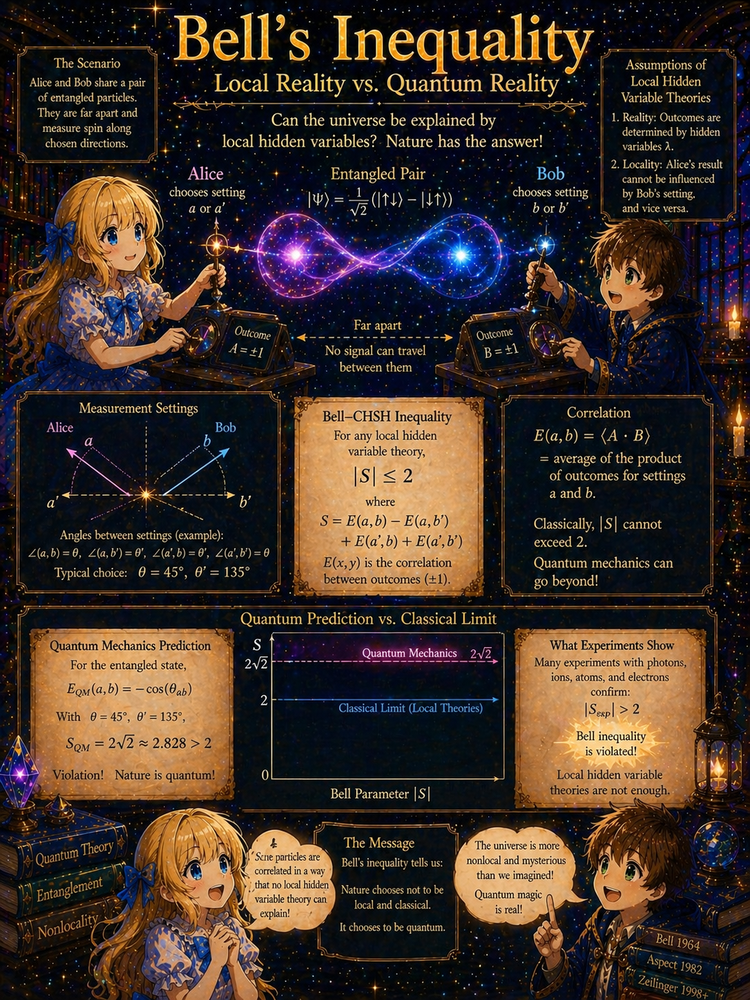
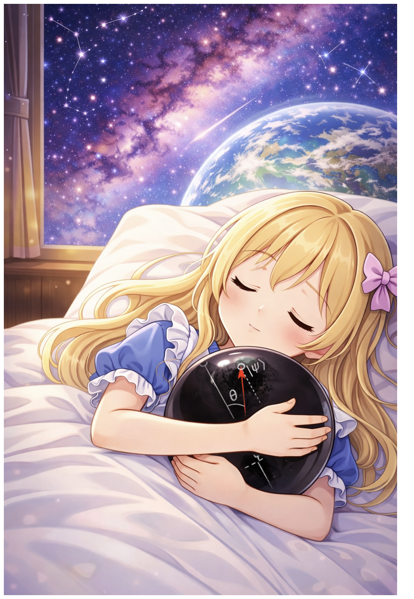

# Bell's Inequality: Where Quantum Mechanics Surpasses Classical Intuition



> **Series**: [From Experiments to Pauli Matrices](NOTE1.md) → [Rotation Operators](NOTE2.md) → [The Bloch Sphere](NOTE3.md) → [The Origin of θ/2](NOTE4.md) → This document (NOTE5.md)

## Purpose of This Document

This document derives Bell's inequality using only the knowledge from the NOTE series.

The tools used are:

- State vectors and measurement ([NOTE1.md](NOTE1.md))
- Pauli matrices $\sigma_x, \sigma_y, \sigma_z$ and the measurement operator $\mathbf{n}\cdot\boldsymbol{\sigma}$ for direction $\mathbf{n}$ ([NOTE1.md](NOTE1.md))
- Spin rotation and eigenstate transformation ([NOTE4.md](NOTE4.md))

As new mathematical tools, we introduce the tensor product for two-particle systems, and as new concepts, local hidden variables and the CHSH framework. Everything else proceeds by combining known tools.

---

## Overview

The derivation proceeds in six stages.

1. **Two-particle state space** → Each particle is 2-dimensional, so together they form a 4-dimensional space
2. **The singlet state** → A special two-particle state with perfect anti-correlation
3. **Quantum-mechanical prediction** → Compute the correlation when Alice and Bob measure in different directions
4. **Attempting a classical explanation** → The hypothesis that "the particles had their answers from the start"
5. **CHSH inequality** → The upper bound $\vert S\vert \leq 2$ derived from that hypothesis
6. **Quantum violation** → Quantum mechanics predicts $\vert S\vert = 2\sqrt{2}$, exceeding the upper bound

---

## Stage 1: Two-Particle State Space

### Review of One Particle

As seen in [NOTE1.md](NOTE1.md), the spin state of a single particle lives in a 2-dimensional space. The $z$-basis is

```math
\vert {+z}\rangle = \begin{pmatrix}1\\0\end{pmatrix}, \qquad
\vert {-z}\rangle = \begin{pmatrix}0\\1\end{pmatrix}
```

and any state can be written as $\alpha\vert {+z}\rangle + \beta\vert {-z}\rangle$.

### Describing Two Particles Simultaneously

Now consider two spin-1/2 particles. Alice holds the first particle, and Bob holds the second.

To write the state of a two-particle system, we need to specify the states of both particles simultaneously. For example, the state "Alice's particle is $\vert {+z}\rangle$ and Bob's particle is $\vert {-z}\rangle$" is written as

```math
\vert {+z}\rangle \otimes \vert {-z}\rangle
```

The symbol $\otimes$ is called the "tensor product," but here it can be read as "and." For brevity, we also write

```math
\vert {+z}\rangle\vert {-z}\rangle \quad \text{or} \quad \vert {+z},{-z}\rangle
```

### Four Basis States

Since each particle has the two possibilities $\vert {+z}\rangle$ and $\vert {-z}\rangle$, the two-particle system has $2 \times 2 = 4$ basis states:

```math
\vert {+z}\rangle\vert {+z}\rangle, \qquad
\vert {+z}\rangle\vert {-z}\rangle, \qquad
\vert {-z}\rangle\vert {+z}\rangle, \qquad
\vert {-z}\rangle\vert {-z}\rangle
```

Any two-particle state can be written as a linear combination of these four.

### Product States and Entangled States

If the two-particle state can be decomposed as a product of "Alice's state" and "Bob's state":

```math
\vert \Psi\rangle = \vert \psi\rangle_A \otimes \vert \phi\rangle_B
```

it is called a **product state**. In a product state, Alice's and Bob's particles each have independent states.

However, the 4-dimensional space also contains states that cannot be decomposed into a product. For example,

```math
\frac{1}{\sqrt{2}}\bigl(\vert {+z}\rangle\vert {-z}\rangle - \vert {-z}\rangle\vert {+z}\rangle\bigr)
```

cannot be written in product form for any choice of $\vert \psi\rangle_A$ and $\vert \phi\rangle_B$. Such a state is called an **entangled state**.

---

## Stage 2: The Singlet State

### Definition

Among entangled two-particle states, one of the most important is the **singlet state**:

```math
\vert \Psi^-\rangle = \frac{1}{\sqrt{2}}\bigl(\vert {+z}\rangle\vert {-z}\rangle - \vert {-z}\rangle\vert {+z}\rangle\bigr)
```

Here the left ket represents Alice's particle and the right ket represents Bob's particle.

This state is a superposition of the component "Alice is $+z$ and Bob is $-z$" and the component "Alice is $-z$ and Bob is $+z$."

### Measuring in the Same Direction Always Gives Opposite Results

Let us see what happens when both Alice and Bob measure in the $z$-direction.

The first term $\vert {+z}\rangle\vert {-z}\rangle$ of $\vert \Psi^-\rangle$ gives "Alice gets $+1$, Bob gets $-1$," and the second term $\vert {-z}\rangle\vert {+z}\rangle$ gives "Alice gets $-1$, Bob gets $+1$." In both terms, Alice's and Bob's results are opposite.

Therefore, the singlet state has **perfect anti-correlation** for $z$-direction measurement. If Alice gets $+1$, Bob always gets $-1$; if Alice gets $-1$, Bob always gets $+1$.

### Rotational Invariance: The Same Holds for Any Direction

In fact, the singlet state has a remarkable property: the perfect anti-correlation above holds not just for the $z$-direction, but for **any direction**.

To confirm this, we rewrite $\vert \Psi^-\rangle$ in the eigenstates of an arbitrary direction $\mathbf{a}$. For simplicity, we take the direction to lie in the $xz$-plane. Since the singlet is invariant under any spatial rotation, the same conclusion holds for general directions.

Suppose $\mathbf{a}$ is at angle $\theta_a$ from the $z$-axis ($\theta_a$ is the polar angle from the $z$-axis).

The eigenstate $\vert {+a}\rangle$ of direction $\mathbf{a}$ is obtained by rotating $\vert {+z}\rangle$ about the $y$-axis by $\theta_a$. To reach a direction tilted by $\theta_a$ from the $z$-axis, one rotates about the $y$-axis by exactly $\theta_a$, so here the polar angle and rotation angle take the same value. Using the rotation matrix from [NOTE4.md](NOTE4.md):

```math
U(\theta, \mathbf{n}) = \cos\frac{\theta}{2}\,I - i\sin\frac{\theta}{2}\,\mathbf{n}\cdot\boldsymbol{\sigma}
```

with $\mathbf{n} = \hat{y}$ and rotation angle $\theta = \theta_a$:

```math
U(\theta_a, \hat{y})
= \cos\frac{\theta_a}{2}\,I - i\sin\frac{\theta_a}{2}\,\sigma_y
= \cos\frac{\theta_a}{2}\begin{pmatrix}1&0\\0&1\end{pmatrix}
- i\sin\frac{\theta_a}{2}\begin{pmatrix}0&-i\\i&0\end{pmatrix}
```

Noting that $-i \cdot (-i) = i^2 = -1$ and $-i \cdot i = -i^2 = 1$:

```math
= \begin{pmatrix}
\cos\frac{\theta_a}{2} & -\sin\frac{\theta_a}{2} \\[4pt]
\sin\frac{\theta_a}{2} & \cos\frac{\theta_a}{2}
\end{pmatrix}
```

Applying this to $\vert {+z}\rangle$:

```math
\vert {+a}\rangle = U(\theta_a, \hat{y})\,\vert {+z}\rangle
= \begin{pmatrix}
\cos\frac{\theta_a}{2} & -\sin\frac{\theta_a}{2} \\[4pt]
\sin\frac{\theta_a}{2} & \cos\frac{\theta_a}{2}
\end{pmatrix}
\begin{pmatrix}1\\0\end{pmatrix}
= \begin{pmatrix}\cos\frac{\theta_a}{2}\\[4pt]\sin\frac{\theta_a}{2}\end{pmatrix}
```

That is,

```math
\vert {+a}\rangle = \cos\frac{\theta_a}{2}\,\vert {+z}\rangle + \sin\frac{\theta_a}{2}\,\vert {-z}\rangle
```

Similarly, $\vert {-a}\rangle = U(\theta_a, \hat{y})\,\vert {-z}\rangle$ is

```math
\vert {-a}\rangle
= \begin{pmatrix}
\cos\frac{\theta_a}{2} & -\sin\frac{\theta_a}{2} \\[4pt]
\sin\frac{\theta_a}{2} & \cos\frac{\theta_a}{2}
\end{pmatrix}
\begin{pmatrix}0\\1\end{pmatrix}
= \begin{pmatrix}-\sin\frac{\theta_a}{2}\\[4pt]\cos\frac{\theta_a}{2}\end{pmatrix}
```

That is,

```math
\vert {-a}\rangle = -\sin\frac{\theta_a}{2}\,\vert {+z}\rangle + \cos\frac{\theta_a}{2}\,\vert {-z}\rangle
```

Spatially, this is a rotation by $\theta_a$, but the state vector coefficients contain $\theta_a/2$. This is the half-angle structure of spinors seen in [NOTE4.md](NOTE4.md). Abbreviating $c = \cos(\theta_a/2)$, $s = \sin(\theta_a/2)$:

```math
\vert {+a}\rangle\vert {-a}\rangle
= (c\vert {+z}\rangle + s\vert {-z}\rangle)(-s\vert {+z}\rangle + c\vert {-z}\rangle)
```

```math
= -cs\vert {+z}\rangle\vert {+z}\rangle + c^2\vert {+z}\rangle\vert {-z}\rangle - s^2\vert {-z}\rangle\vert {+z}\rangle + sc\vert {-z}\rangle\vert {-z}\rangle
```

```math
\vert {-a}\rangle\vert {+a}\rangle
= (-s\vert {+z}\rangle + c\vert {-z}\rangle)(c\vert {+z}\rangle + s\vert {-z}\rangle)
```

```math
= -sc\vert {+z}\rangle\vert {+z}\rangle - s^2\vert {+z}\rangle\vert {-z}\rangle + c^2\vert {-z}\rangle\vert {+z}\rangle + cs\vert {-z}\rangle\vert {-z}\rangle
```

Taking the difference:

```math
\vert {+a}\rangle\vert {-a}\rangle - \vert {-a}\rangle\vert {+a}\rangle
```

Coefficient of $\vert {+z}\rangle\vert {+z}\rangle$: $-cs - (-sc) = 0$

Coefficient of $\vert {+z}\rangle\vert {-z}\rangle$: $c^2 - (-s^2) = c^2 + s^2 = 1$

Coefficient of $\vert {-z}\rangle\vert {+z}\rangle$: $-s^2 - c^2 = -(s^2 + c^2) = -1$

Coefficient of $\vert {-z}\rangle\vert {-z}\rangle$: $sc - cs = 0$

Therefore

```math
\vert {+a}\rangle\vert {-a}\rangle - \vert {-a}\rangle\vert {+a}\rangle
= \vert {+z}\rangle\vert {-z}\rangle - \vert {-z}\rangle\vert {+z}\rangle
```

Dividing both sides by $\sqrt{2}$:

<table border="1" align="center"><tr><td markdown="1">

```math
\frac{1}{\sqrt{2}}\bigl(\vert {+a}\rangle\vert {-a}\rangle - \vert {-a}\rangle\vert {+a}\rangle\bigr) = \vert \Psi^-\rangle
```

</td></tr></table>

The singlet state has the same form whether written in the $z$-basis or the $\mathbf{a}$-basis. This is **rotational invariance**.

From this result, no matter which direction $\mathbf{a}$ Alice measures in, Bob's particle is determined to be in the state opposite to Alice's:

- Alice gets $+1$ in the $\mathbf{a}$-direction → Bob's particle becomes $\vert {-a}\rangle$
- Alice gets $-1$ in the $\mathbf{a}$-direction → Bob's particle becomes $\vert {+a}\rangle$

Each occurs with probability $1/2$.

---

## Stage 3: Correlation When Measured in Different Directions

### Setting Up the Question

Alice measures along direction $\mathbf{a}$, and Bob measures along direction $\mathbf{b}$. Let $\theta$ be the angle between the two directions.

For the same direction, we have perfect anti-correlation (the pair $+1$ and $-1$ always appears). What happens when the directions differ?

Let the results of each measurement be $A = \pm 1$ (Alice) and $B = \pm 1$ (Bob), and compute the expectation value of their product:

```math
E(\mathbf{a}, \mathbf{b}) = \langle A \cdot B \rangle
```

This is the **correlation**.

- $E = -1$: perfect anti-correlation (always opposite)
- $E = +1$: perfect positive correlation (always the same)
- $E = 0$: no correlation

### Computation

By rotational invariance, when Alice measures in the $\mathbf{a}$-direction:

- Result is $+1$ (probability $1/2$) → Bob's particle is $\vert {-a}\rangle$
- Result is $-1$ (probability $1/2$) → Bob's particle is $\vert {+a}\rangle$

Bob measures in direction $\mathbf{b}$. Let $\theta$ be the angle between $\mathbf{a}$ and $\mathbf{b}$.

**When Alice gets $+1$ (Bob's particle is $\vert {-a}\rangle$):**

The probability that Bob gets $+1$ is $\vert \langle{+b}\vert {-a}\rangle\vert ^2$, and the probability of $-1$ is $\vert \langle{-b}\vert {-a}\rangle\vert ^2$.

Taking $\mathbf{a}$ and $\mathbf{b}$ in the same $xz$-plane with angles $\theta_a$, $\theta_b$ from the $z$-axis ($\theta = \theta_b - \theta_a$). From the rotation in [NOTE4.md](NOTE4.md):

```math
\vert {+b}\rangle = \cos\frac{\theta_b}{2}\vert {+z}\rangle + \sin\frac{\theta_b}{2}\vert {-z}\rangle
```

```math
\vert {-a}\rangle = -\sin\frac{\theta_a}{2}\vert {+z}\rangle + \cos\frac{\theta_a}{2}\vert {-z}\rangle
```

Computing the inner product:

```math
\langle{+b}\vert {-a}\rangle
= -\cos\frac{\theta_b}{2}\sin\frac{\theta_a}{2} + \sin\frac{\theta_b}{2}\cos\frac{\theta_a}{2}
= \sin\frac{\theta_b - \theta_a}{2}
= \sin\frac{\theta}{2}
```

Here we used the addition formula $\sin\alpha\cos\beta - \cos\alpha\sin\beta = \sin(\alpha - \beta)$.

Similarly:

```math
\langle{-b}\vert {-a}\rangle
= \sin\frac{\theta_b}{2}\sin\frac{\theta_a}{2} + \cos\frac{\theta_b}{2}\cos\frac{\theta_a}{2}
= \cos\frac{\theta_b - \theta_a}{2}
= \cos\frac{\theta}{2}
```

Therefore

```math
P(B = +1 \mid A = +1) = \sin^2\frac{\theta}{2}, \qquad
P(B = -1 \mid A = +1) = \cos^2\frac{\theta}{2}
```

**When Alice gets $-1$ (Bob's particle is $\vert {+a}\rangle$):**

Repeating the same calculation:

```math
\langle{+b}\vert {+a}\rangle
= \cos\frac{\theta_b}{2}\cos\frac{\theta_a}{2} + \sin\frac{\theta_b}{2}\sin\frac{\theta_a}{2}
= \cos\frac{\theta}{2}
```

```math
P(B = +1 \mid A = -1) = \cos^2\frac{\theta}{2}, \qquad
P(B = -1 \mid A = -1) = \sin^2\frac{\theta}{2}
```

### Assembling the Correlation

```math
E(\mathbf{a}, \mathbf{b})
= \sum_{A,B = \pm 1} A \cdot B \cdot P(A, B)
```

The joint probability $P(A, B)$ is the product of Alice's measurement probability $P(A)$ and the conditional probability $P(B \mid A)$ of Bob's result given Alice's: $P(A, B) = P(A) \cdot P(B \mid A)$. Since the singlet state is rotationally invariant, Alice's results are equally probable regardless of direction: $P(A = +1) = P(A = -1) = 1/2$ (neither orientation is special). Therefore

```math
E = \frac{1}{2}\Bigl[(+1)(+1)\sin^2\frac{\theta}{2} + (+1)(-1)\cos^2\frac{\theta}{2}\Bigr]
  + \frac{1}{2}\Bigl[(-1)(+1)\cos^2\frac{\theta}{2} + (-1)(-1)\sin^2\frac{\theta}{2}\Bigr]
```

Simplifying each term:

```math
= \frac{1}{2}\Bigl[\sin^2\frac{\theta}{2} - \cos^2\frac{\theta}{2}\Bigr]
+ \frac{1}{2}\Bigl[-\cos^2\frac{\theta}{2} + \sin^2\frac{\theta}{2}\Bigr]
```

```math
= \sin^2\frac{\theta}{2} - \cos^2\frac{\theta}{2}
```

Since $\cos\theta = \cos^2(\theta/2) - \sin^2(\theta/2)$:

<table border="1" align="center"><tr><td markdown="1">

```math
E(\mathbf{a}, \mathbf{b}) = -\cos\theta = -\mathbf{a}\cdot\mathbf{b}
```

</td></tr></table>

This is the central result underlying the entire Bell inequality discussion.

Why is this result important? In a classical theory (with hidden variables), the form of the correlation $E(\theta)$ itself can be engineered in various ways. However, when four measurement directions are chosen appropriately and their correlations are combined, there exists an upper bound that classical theories can never exceed (the CHSH inequality). The quantum-mechanical $E = -\cos\theta$ is a curve generated by the Born rule probabilities $\cos^2(\theta/2)$, $\sin^2(\theta/2)$ — coming from inner products of state vectors — and this curve exceeds that upper bound. We will see this quantitatively in the next stage.

### Verification

- $\theta = 0$ (same direction): $E = -1$ (perfect anti-correlation) ✓
- $\theta = \pi$ (opposite direction): $E = +1$ (perfect positive correlation) ✓
- $\theta = \pi/2$ (perpendicular): $E = 0$ (no correlation) ✓

---

## Stage 4: Attempting a Classical Explanation

### Einstein's Question

Let us pause and think.

When Alice measures along direction $\mathbf{a}$, Bob's particle is instantly determined to be $\vert {-a}\rangle$ (or $\vert {+a}\rangle$) — no matter how far apart Alice and Bob are.

However, the measurement statistics visible to Bob alone are unchanged regardless of what Alice does, and this correlation cannot be used to send signals faster than light (quantum mechanics is consistent with special relativity in this sense).

Then wouldn't it be more natural to think that Bob's particle **had its answer from the start**?

This is the argument of Einstein, Podolsky, and Rosen (EPR).

### The Hidden Variable Hypothesis

Formulating the EPR argument mathematically leads to the following hypothesis:

> At the moment the two particles are created, the measurement results are predetermined for each particle — at least for the directions that could be chosen in the experiment, the values that would have been obtained even for unmeasured directions simultaneously exist. What determines these predetermined values is the hidden variable $\lambda$.

Specifically:

- When Alice measures in direction $\mathbf{a}$, the result is the predetermined value $A(\mathbf{a}, \lambda) = \pm 1$
- When Bob measures in direction $\mathbf{b}$, the result is the predetermined value $B(\mathbf{b}, \lambda) = \pm 1$

The crucial assumption here is **locality**:

- Alice's result $A(\mathbf{a}, \lambda)$ does not depend on Bob's measurement direction $\mathbf{b}$
- Bob's result $B(\mathbf{b}, \lambda)$ does not depend on Alice's measurement direction $\mathbf{a}$

In other words, "Alice's choice does not affect Bob's result," and vice versa.

Since different particle pairs can have different $\lambda$, the correlation is obtained by averaging over the distribution of $\lambda$:

```math
E(\mathbf{a}, \mathbf{b}) = \int A(\mathbf{a}, \lambda)\,B(\mathbf{b}, \lambda)\,\rho(\lambda)\,d\lambda
```

where $\rho(\lambda)$ is the probability distribution of $\lambda$ ($\int \rho\,d\lambda = 1$, $\rho \geq 0$). There is another implicit assumption: $\rho(\lambda)$ does not depend on which directions Alice and Bob choose — that is, the choice of measurement directions and the hidden variable are statistically independent.

The question is: **Can this framework reproduce the quantum-mechanical prediction $E = -\cos\theta$?**

### A Single Pair of Directions Is No Problem

First, let us confirm a case where hidden variables work.

Consider Alice and Bob measuring in the same direction $\mathbf{a}$. The quantum prediction is perfect anti-correlation ($E = -1$), and the results are restricted to just two patterns:

| Alice | Bob |
|:---:|:---:|
| $+1$ | $-1$ |
| $-1$ | $+1$ |

This is perfectly explained by "at the moment the particles were created, Alice's and Bob's results were predetermined to be opposite." There is no need to invoke entanglement.

Next, consider Bob measuring in a direction $\mathbf{b}$ (tilted by $\theta$ from $\mathbf{a}$). When Alice gets $+1$, Bob gets $+1$ with probability $\sin^2(\theta/2)$ and $-1$ with probability $\cos^2(\theta/2)$. At first glance, the entanglement effect seems visible, but —

This probability distribution can also be reproduced by hidden variables. For example, one can imagine that "at the moment the particle pair is created, a hidden instruction sheet $\lambda$ is enclosed such that if Alice measures $\mathbf{a}$ and gets $+1$, then Bob measuring $\mathbf{b}$ gets $+1$ with probability $\sin^2(\theta/2)$ and $-1$ with probability $\cos^2(\theta/2)$." By choosing the distribution of $\lambda$ appropriately, the correlation $E(\mathbf{a}, \mathbf{b}) = -\cos\theta$ can be reproduced exactly.

**In other words, with just one pair of measurement directions, "predetermined from the start" and "determined on the spot through entanglement" cannot be distinguished experimentally.**

### So What Goes Wrong?

The difficulty arises when **trying to construct instruction sheets that are simultaneously consistent for multiple directions**.

Let us think concretely. Alice chooses either $\mathbf{a}$ or $\mathbf{a}'$, and Bob chooses either $\mathbf{b}$ or $\mathbf{b}'$. Under the hidden variable hypothesis, all four values are determined at the moment the particle pair is created:

```math
A(\mathbf{a}, \lambda) = \pm 1, \quad
A(\mathbf{a}', \lambda) = \pm 1, \quad
B(\mathbf{b}, \lambda) = \pm 1, \quad
B(\mathbf{b}', \lambda) = \pm 1
```

This is the crucial point. **In an actual experiment, for each pair, Alice can measure only one of $\mathbf{a}$ or $\mathbf{a}'$. The same goes for Bob.** However, the hidden variable hypothesis asserts that "the value for the unmeasured direction also exists."

### Why Hidden Variables Are Constrained

What is decisive about the hidden variable hypothesis is that **Bob's value $B(\mathbf{b}, \lambda)$ does not depend on Alice's measurement choice**.

Whether Alice measures $\mathbf{a}$ or $\mathbf{a}'$, the value that Bob's particle returns for direction $\mathbf{b}$ is the same $B(\mathbf{b}, \lambda)$. This is because the value was determined at the moment the particles were created, and Alice's actions far away do not affect Bob's result (locality).

This sounds obvious, but it has profound consequences. The $B$ appearing in the computation of correlation $E(\mathbf{a}, \mathbf{b})$ and correlation $E(\mathbf{a}', \mathbf{b})$ is **the same value**. All four values $A, A', B, B'$ can each only take $\pm 1$, and they are shared across all four pairs of correlations. From this constraint arises the upper bound $\vert S\vert \leq 2$.

### Why Quantum Mechanics Escapes This Constraint

In quantum mechanics, the situation is entirely different.

When Alice measures in direction $\mathbf{a}$ from the singlet state and gets $+1$, Bob's particle becomes $\vert {-a}\rangle$. On the other hand, when Alice measures in direction $\mathbf{a}'$ and gets $+1$, Bob's particle becomes $\vert {-a'}\rangle$.

Even if Bob measures the same direction $\mathbf{b}$, the **probability distribution of the result changes** depending on whether the original state is $\vert {-a}\rangle$ or $\vert {-a'}\rangle$:

- Measuring $\vert {-a}\rangle$ in direction $\mathbf{b}$ → $P(+1) = \sin^2(\theta_{ab}/2)$
- Measuring $\vert {-a'}\rangle$ in direction $\mathbf{b}$ → $P(+1) = \sin^2(\theta_{a'b}/2)$

That is, conditioning on Alice's result assigns a different conditional state — $\vert {-a}\rangle$ or $\vert {-a'}\rangle$ — to Bob. However, an important caveat: looking at Bob's statistics alone, the results are always 50-50 for $+1$ and $-1$ regardless of what Alice chooses — in this sense, Alice's choice does not "send a signal" to Bob. The difference appears only when Alice's and Bob's results are compared to examine the **correlation**.

In hidden variables, the four correlations are bound by the algebraic constraint of "sharing the same $B$." In quantum mechanics, the conditional state of Bob that generates correlation $E(\mathbf{a}, \mathbf{b})$ and the one that generates $E(\mathbf{a}', \mathbf{b})$ differ, so **the four correlations are not subject to the algebraic constraint of simultaneously determined $A, A', B, B'$**. This difference is what makes $\vert S\vert > 2$ possible.

In the next stage, we show quantitatively how large this difference can be.

---

## Stage 5: The CHSH Inequality

### Choosing Four Measurement Directions

Bell's inequality comes in several forms. Here we derive the most widely used form, **CHSH (Clauser–Horne–Shimony–Holt)**.

Alice chooses one of two directions $\mathbf{a}$ and $\mathbf{a}'$, and Bob chooses one of two directions $\mathbf{b}$ and $\mathbf{b}'$. For each particle pair, both Alice and Bob can measure only one of their two options.

From the four correlations, construct the following quantity:

```math
S = E(\mathbf{a}, \mathbf{b}) - E(\mathbf{a}, \mathbf{b}') + E(\mathbf{a}', \mathbf{b}) + E(\mathbf{a}', \mathbf{b}')
```

### Under Hidden Variables, $\vert S\vert \leq 2$

Under the hidden variable hypothesis, for each particle pair (with hidden variable $\lambda$), four values

```math
A = A(\mathbf{a}, \lambda), \quad
A' = A(\mathbf{a}', \lambda), \quad
B = B(\mathbf{b}, \lambda), \quad
B' = B(\mathbf{b}', \lambda)
```

are **all simultaneously determined**. Each value is $\pm 1$.

This is the decisively important point. In quantum mechanics, Alice can measure only one of $\mathbf{a}$ or $\mathbf{a}'$. However, the hidden variable hypothesis assumes that "the value for the unmeasured direction also exists."

Under this assumption, for each particle pair consider the quantity

```math
s(\lambda) = A B - A B' + A' B + A' B'
```

Separating terms containing $A$ from those containing $A'$ and rearranging:

```math
s(\lambda) = \underbrace{AB - AB'}_{A\text{ terms}} + \underbrace{A'B + A'B'}_{A'\text{ terms}}
= A(B - B') + A'(B + B')
```

Since $B, B' = \pm 1$, the combinations $B - B'$ and $B + B'$ take only two forms:

When $B = B'$: $B - B' = 0$, $B + B' = \pm 2$, so

```math
s = A \cdot 0 + A' \cdot (\pm 2) = \pm 2
```

When $B = -B'$: $B - B' = \pm 2$, $B + B' = 0$, so

```math
s = A \cdot (\pm 2) + A' \cdot 0 = \pm 2
```

In both cases $s(\lambda) = \pm 2$, so

```math
\vert s(\lambda)\vert = 2
```

holds for each particle pair. Averaging over $\lambda$:

```math
\vert S\vert = \left\vert \int s(\lambda)\,\rho(\lambda)\,d\lambda\right\vert 
\leq \int \vert s(\lambda)\vert \,\rho(\lambda)\,d\lambda
= 2\int \rho(\lambda)\,d\lambda
= 2
```

Therefore

<table border="1" align="center"><tr><td markdown="1">

```math
\vert S\vert \leq 2 \qquad \text{(CHSH inequality)}
```

</td></tr></table>

This inequality is derived solely from the hidden variable hypothesis — the assumption that values are predetermined (realism), that they do not depend on distant settings (locality), and that the choice of measurement directions is independent of $\lambda$ — without using any laws of quantum mechanics.

---

## Stage 6: Quantum Mechanics Exceeds the Upper Bound

### Choosing the Directions

In Stage 3 we derived $E(\mathbf{a}, \mathbf{b}) = -\cos\theta$. Using this formula, we compute $S$ and search for directions where $\vert S\vert > 2$.

All four directions are taken in the $xz$-plane and specified by their angles from the $z$-axis:

```math
\mathbf{a}: 0^\circ, \qquad
\mathbf{b}: 45^\circ, \qquad
\mathbf{a}': 90^\circ, \qquad
\mathbf{b}': 135^\circ
```

That is, the four directions are evenly spaced at 45-degree intervals.

### Computing Each Correlation

Compute the angle between each pair and $E = -\cos\theta$:

$E(\mathbf{a}, \mathbf{b})$: $\theta = 45^\circ$

```math
E(\mathbf{a}, \mathbf{b}) = -\cos 45^\circ = -\frac{1}{\sqrt{2}}
```

$E(\mathbf{a}, \mathbf{b}')$: $\theta = 135^\circ$

```math
E(\mathbf{a}, \mathbf{b}') = -\cos 135^\circ = -\left(-\frac{1}{\sqrt{2}}\right) = +\frac{1}{\sqrt{2}}
```

$E(\mathbf{a}', \mathbf{b})$: $\theta = 90^\circ - 45^\circ = 45^\circ$

```math
E(\mathbf{a}', \mathbf{b}) = -\cos 45^\circ = -\frac{1}{\sqrt{2}}
```

$E(\mathbf{a}', \mathbf{b}')$: $\theta = 135^\circ - 90^\circ = 45^\circ$

```math
E(\mathbf{a}', \mathbf{b}') = -\cos 45^\circ = -\frac{1}{\sqrt{2}}
```

### Computing $S$

```math
S = E(\mathbf{a}, \mathbf{b}) - E(\mathbf{a}, \mathbf{b}') + E(\mathbf{a}', \mathbf{b}) + E(\mathbf{a}', \mathbf{b}')
```

```math
= \left(-\frac{1}{\sqrt{2}}\right) - \left(+\frac{1}{\sqrt{2}}\right) + \left(-\frac{1}{\sqrt{2}}\right) + \left(-\frac{1}{\sqrt{2}}\right)
```

```math
= -\frac{1}{\sqrt{2}} - \frac{1}{\sqrt{2}} - \frac{1}{\sqrt{2}} - \frac{1}{\sqrt{2}}
```

```math
= -\frac{4}{\sqrt{2}} = -2\sqrt{2}
```

Therefore

<table border="1" align="center"><tr><td markdown="1">

```math
\vert S\vert = 2\sqrt{2} \approx 2.83
```

</td></tr></table>

This clearly exceeds the CHSH upper bound of $2$.

### What Happened?

The CHSH inequality was derived from the assumptions that measurement results are predetermined (realism), that they do not depend on distant settings (locality), and that the choice of measurement direction is free. Quantum mechanics exceeds this upper bound.

Therefore, **the naive local realism that measurement results are simultaneously predetermined and unaffected by distant measurement settings cannot hold**. In short, locality and realism cannot both be maintained. This is the heart of Bell's inequality.

### Experiment Settled the Matter

This is not an armchair argument. Experiment has settled the matter.

Beginning with Freedman and Clauser in 1972, through the experiments of Aspect et al. in 1982, and culminating in the "loophole-free" experiments of 2015, numerous experiments using photon polarization and atomic/electron spins have **repeatedly violated** the classical upper bound $\vert S\vert \leq 2$ of the CHSH inequality. In particular, experiments where the measurement directions were switched in a time shorter than light could travel between the two detectors have ruled out even the possibility that one result was communicated to the other by a subluminal signal.

Nature has decisively betrayed our naive intuition — that results must be determined before measurement, that operations at distant locations cannot instantaneously influence each other. The quantum-mechanical prediction $\vert S\vert = 2\sqrt{2}$ is the one that is correct.

The 2022 Nobel Prize in Physics was awarded to Aspect, Clauser, and Zeilinger precisely for the experimental verification of Bell's inequality. Half a century of accumulated experiments established that quantum entanglement is not merely a theoretical curiosity, but a fundamental property of nature.

---

## Supplement: $2\sqrt{2}$ Is Also the Quantum Upper Bound

Under hidden variables, $\vert S\vert \leq 2$. Under quantum mechanics, $\vert S\vert = 2\sqrt{2}$. How large can $\vert S\vert$ get?

If the four correlations of $A, B = \pm 1$ could be freely chosen, the algebraic maximum from the definition of $S$ would be $\vert S\vert = 4$ (if all four correlations were $\pm 1$ in the same direction).

However, quantum mechanics never reaches $4$; the upper bound is $2\sqrt{2}$ (Tsirelson's bound).

```math
2 \quad \leq \quad 2\sqrt{2} \quad \leq \quad 4
```

```math
\text{Classical bound} \qquad \text{Quantum bound} \qquad \text{Algebraic bound}
```

Quantum mechanics exceeds the classical bound but does not reach the algebraically possible maximum. The physical meaning of this intermediate position is still an active area of research.

---

## Logical Structure (Review)

```
Single-particle spin state (2-dimensional)  ← NOTE1.md
    ↓
Two particles: 2×2 = 4-dimensional (tensor product)
    ↓
Singlet |Ψ⁻⟩ = (|+z⟩|−z⟩ − |−z⟩|+z⟩)/√2
    ↓
Rotational invariance: same form in any basis
    ↓
Alice measures along a → Bob's particle becomes |−a⟩
    ↓
Compute Bob's measurement probability via Born rule
    ↓
E(a,b) = −cos θ = −a·b    ← quantum prediction
    ↓
Hypothesis: "the answers were determined from the start" (hidden variables)
    ↓
|A(B−B') + A'(B+B')| = 2  ← algebra of ±1 for each pair
    ↓
Averaging: |S| ≤ 2   ← CHSH inequality
    ↓
Choose 4 directions at 45° intervals → |S| = 2√2 > 2
    ↓
Naive local realism is incompatible with quantum mechanics
```



