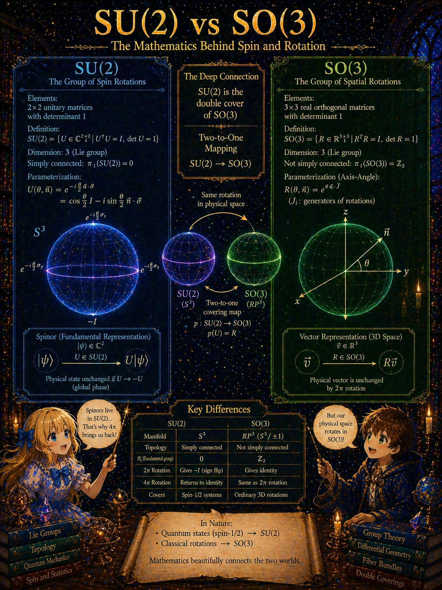

# Supplement: A Mini Introduction to Group Theory — SU(2) and SO(3)



> **Series**: [From Experiments to Pauli Matrices](NOTE1.md) → [Rotation Operators](NOTE2.md) → [The Bloch Sphere](NOTE3.md) → [The Origin of θ/2](NOTE4.md) → [Bell's Inequality](NOTE5.md) → This document (NOTE6.md)

## Purpose of This Document

In [NOTE4.md](NOTE4.md), the statement appeared that "the rotation of spin 1/2 is a representation of $\mathrm{SU}(2)$, not $\mathrm{SO}(3)$." Here, we introduce the minimum amount of group theory needed to understand what this means.

---

## What Is a Group?

A **group** is a set together with an operation,

```math
(G, \cdot)
```

satisfying the following four properties.

1. **Closure**: If $a, b \in G$, then $a \cdot b \in G$ (the result of the operation is also in the set).
2. **Associativity**: $(a \cdot b) \cdot c = a \cdot (b \cdot c)$
3. **Identity element**: There exists an element $e$ such that $e \cdot a = a \cdot e = a$.
4. **Inverse element**: For each $a$, there exists $a^{-1}$ such that $a \cdot a^{-1} = a^{-1} \cdot a = e$.

Note that **commutativity** $a \cdot b = b \cdot a$ is not required. A group where commutativity holds is called an **abelian group**, and one where it does not is called a **non-abelian group**. Rotations are a typical example of a non-abelian group.

### Familiar Examples

**Example 1: The integers under addition** $(\mathbb{Z}, +)$

The integers form a group under addition. The identity element is $0$, and the inverse of $a$ is $-a$. Since commutativity holds, this is an abelian group.

**Example 2: Rotations in 3-dimensional space**

The set of all rotations forms a group under composition. The identity element is "the rotation that does nothing," and the inverse is "rotating by the same angle in the opposite direction." However, since changing the order of rotations changes the result, this is a non-abelian group.

---

## The Rotation Group SO(3)

Representing 3-dimensional rotations as matrices, we obtain the set of all $3 \times 3$ real matrices $R$ satisfying

```math
R^T R = I, \qquad \det R = +1
```

The first condition $R^T R = I$ means "the column vectors are mutually orthogonal and have unit length" (orthogonal matrix), and the second condition $\det R = +1$ excludes reflections.

This set of matrices is denoted $\mathrm{SO}(3)$. The name comes from

- **S** = special (determinant is $+1$)
- **O** = orthogonal
- **3** = $3 \times 3$

$\mathrm{SO}(3)$ satisfies the four group axioms. Specifically:

- **Closure**: The composition of two rotations is a rotation.
- **Associativity**: Matrix multiplication is always associative.
- **Identity element**: The identity matrix $I$.
- **Inverse element**: $R^{-1} = R^T$ (the inverse of an orthogonal matrix is its transpose).

### Counting Parameters

A general $3 \times 3$ matrix has $9$ components. How many constraints does the condition $R^T R = I$ impose? The left-hand side $R^T R$ is always a symmetric matrix, because

```math
(R^T R)^T = R^T (R^T)^T = R^T R
```

A $3 \times 3$ symmetric matrix has $3$ diagonal and $3$ upper-triangular independent components, totaling $6$. Thus $R^T R = I$ imposes $6$ independent constraints, and the number of degrees of freedom is

```math
9 - 6 = 3
```

These three degrees of freedom correspond to the direction of the rotation axis (2 parameters) and the rotation angle (1 parameter).

---

## The Unitary Group SU(2)

The set of all $2 \times 2$ complex matrices $U$ satisfying

```math
U^{\dagger} U = I, \qquad \det U = +1
```

is denoted $\mathrm{SU}(2)$. The name comes from

- **S** = special (determinant is $+1$)
- **U** = unitary
- **2** = $2 \times 2$

The first condition $U^{\dagger} U = I$ is the unitarity condition meaning "the column vectors are orthogonal and have unit length," which is the complex analogue of the orthogonality condition in $\mathrm{SO}(3)$.

### Counting Parameters

A $2 \times 2$ complex matrix has $4$ complex components, i.e., $8$ real parameters. Organizing the constraints:

- $U^{\dagger} U = I$ is a Hermitian matrix condition, giving $4$ real constraints.
- $\det U = 1$ is a complex number condition, giving $2$ real constraints (real and imaginary parts).

However, one of the two constraints from $\det U = 1$ is redundant. Taking the determinant of both sides of $U^{\dagger} U = I$ gives $\vert \det U\vert ^2 = 1$, i.e., $\vert \det U\vert = 1$ automatically. This already includes the "absolute value equals 1" part of $\det U = 1$, so the only independent constraint added by $\det U = 1$ is that "the argument is 0" — just 1 constraint. Therefore, the total number of independent constraints is $4 + 1 = 5$, and the degrees of freedom are

```math
8 - 5 = 3
```

This gives the same three degrees of freedom as $\mathrm{SO}(3)$. This is not a coincidence (as we will see below).

### General Form of an SU(2) Matrix

Combining $\det U = 1$ with the unitarity condition, the general element of $\mathrm{SU}(2)$ can be written as

```math
U = \begin{pmatrix} a & -b^* \\ b & a^* \end{pmatrix}, \qquad \vert a\vert ^2 + \vert b\vert ^2 = 1
```

where $a, b$ are complex numbers. Counting real parameters gives $4 - 1 = 3$ degrees of freedom, consistent with the argument above.

---

## The Correspondence from SU(2) to SO(3)

The spin-1/2 rotation operator seen in [NOTE4.md](NOTE4.md),

```math
U(\theta, \mathbf{n}) = \cos\frac{\theta}{2}\,I - i\sin\frac{\theta}{2}\,\mathbf{n}\cdot\boldsymbol{\sigma}
```

is an element of $\mathrm{SU}(2)$. One can directly verify that it is unitary and has determinant $+1$.

This $U$ acts on the state vector (spinor) as

```math
\vert \psi\rangle \;\longrightarrow\; U\vert \psi\rangle
```

On the other hand, the transformation of the Bloch vector $\mathbf{r}$ is

```math
\mathbf{r} \;\longrightarrow\; R(\theta, \mathbf{n})\,\mathbf{r}
```

where $R$ is a $3 \times 3$ rotation matrix $R \in \mathrm{SO}(3)$.

That is, for each element $U$ of $\mathrm{SU}(2)$, there is a corresponding element $R$ of $\mathrm{SO}(3)$. We write this correspondence as

```math
U \;\longmapsto\; R
```

### Double Cover: A 2-to-1 Correspondence

The crucial point is that $U$ and $-U$ correspond to the **same** $R$.

Applying $-U$ to the state vector gives

```math
\vert \psi\rangle \;\longrightarrow\; -U\vert \psi\rangle = e^{i\pi}\,U\vert \psi\rangle
```

This differs from $U\vert \psi\rangle$ only by an overall phase $e^{i\pi}$. The difference in overall phase is undetectable by measurement. For any measurement,

```math
\vert \langle\phi\vert (-U\vert \psi\rangle)\vert ^2
= \vert e^{i\pi}\vert ^2 \cdot \vert \langle\phi\vert U\vert \psi\rangle\vert ^2
= \vert \langle\phi\vert U\vert \psi\rangle\vert ^2
```

so the probabilities are identical (by the Born rule introduced in [NOTE1.md](NOTE1.md)). Since the Bloch vector is determined by measurement probabilities, $U\vert \psi\rangle$ and $-U\vert \psi\rangle$ point to the same location on the Bloch sphere. Therefore, $U$ and $-U$ represent the same spatial rotation.

```math
U \;\longmapsto\; R, \qquad -U \;\longmapsto\; R
```

Conversely, for any $R \in \mathrm{SO}(3)$, the corresponding elements of $\mathrm{SU}(2)$ are exactly $U$ and $-U$ — two and only two. This "2-to-1" correspondence is called a **double cover**.

### $2\pi$ Rotation and $4\pi$ Rotation

Substituting $\theta = 2\pi$ into the rotation operator,

```math
U(2\pi, \mathbf{n}) = \cos\pi\,I - i\sin\pi\,\mathbf{n}\cdot\boldsymbol{\sigma} = -I
```

It does **not** return to the identity matrix. However, the corresponding spatial rotation is $R(2\pi, \mathbf{n}) = I$, so as a spatial rotation it does return to the original.

Substituting $\theta = 4\pi$,

```math
U(4\pi, \mathbf{n}) = \cos 2\pi\,I - i\sin 2\pi\,\mathbf{n}\cdot\boldsymbol{\sigma} = +I
```

Only now does it return to the identity matrix.

| Rotation angle | $\mathrm{SO}(3)$ (Bloch vector) | $\mathrm{SU}(2)$ (state vector) |
|--------|--------------------------------------|-----------------------------------|
| $0$ | $I$ (original position) | $+I$ |
| $2\pi$ | $I$ (original position) | $-I$ (sign flip) |
| $4\pi$ | $I$ (original position) | $+I$ (fully restored) |

This is the reason, stated in the language of group theory, why a spin-1/2 particle changes sign under $2\pi$ rotation and returns to its original state only after $4\pi$ rotation.

---

## What Is a Representation?

To generalize the discussion above, we introduce the concept of a **representation**.

A representation of a group $G$ is a map that assigns a matrix $D(g)$ to each element $g$ of $G$, preserving the group operation:

```math
D(g_1 \cdot g_2) = D(g_1)\,D(g_2)
```

In other words, it is a "dictionary that translates group elements into matrices." It allows us to reduce the abstract structure of a group to concrete matrix multiplication.

### A Concrete Example

Consider two operations: rotation by $\pi/2$ and rotation by $\pi$ about the $z$-axis. Writing these as spin-1/2 rotation operators (the 2-dimensional representation of $\mathrm{SU}(2)$), we get the following.

Rotation by $\pi/2$ about the $z$-axis:

```math
U_1 = U(\pi/2,\, \hat{z})
= \begin{pmatrix}e^{-i\pi/4} & 0 \\ 0 & e^{+i\pi/4}\end{pmatrix}
= \frac{1}{\sqrt{2}}\begin{pmatrix}1-i & 0 \\ 0 & 1+i\end{pmatrix}
```

Rotation by $\pi$ about the $z$-axis:

```math
U_2 = U(\pi,\, \hat{z})
= \begin{pmatrix}e^{-i\pi/2} & 0 \\ 0 & e^{+i\pi/2}\end{pmatrix}
= \begin{pmatrix}-i & 0 \\ 0 & i\end{pmatrix}
```

Applying $U_1$ twice should give $U_2$. Let us verify:

```math
U_1 \cdot U_1
= \frac{1}{2}\begin{pmatrix}(1-i)^2 & 0 \\ 0 & (1+i)^2\end{pmatrix}
= \frac{1}{2}\begin{pmatrix}-2i & 0 \\ 0 & 2i\end{pmatrix}
= \begin{pmatrix}-i & 0 \\ 0 & i\end{pmatrix}
= U_2 \quad\checkmark
```

The group operation (composition of rotations) is reproduced as matrix multiplication. This is the meaning of "representation."

### Representing the Same Rotation in Different Dimensions

The important point is that the **same rotation** can be represented by matrices of different sizes.

Writing the same $\pi/2$ rotation about the $z$-axis as a 3-dimensional rotation matrix:

```math
R_1 = R(\pi/2,\, \hat{z})
= \begin{pmatrix}0 & -1 & 0 \\ 1 & 0 & 0 \\ 0 & 0 & 1\end{pmatrix}
```

$U_1$ is $2 \times 2$ and $R_1$ is $3 \times 3$, but they represent the same physical operation: "$\pi/2$ rotation about the $z$-axis."

In the context of spin 1/2:

- The $2 \times 2$ matrix $U(\theta, \mathbf{n})$ of $\mathrm{SU}(2)$ is the **2-dimensional representation** (spinor representation) of the rotation group — it acts on state vectors.
- The $3 \times 3$ matrix $R(\theta, \mathbf{n})$ of $\mathrm{SO}(3)$ is the **3-dimensional representation** (vector representation) of the rotation group — it acts on Bloch vectors.

The same operation called "rotation" is being expressed by matrices of different dimensions. Which dictionary to use depends on what you want to rotate (state vectors or spatial vectors).

### Both Representations Yield the Same Physics

The two representations look different, but they yield identical physical predictions. This was already verified concretely in [NOTE3.md](NOTE3.md).

When measuring spin along a direction $\mathbf{n}$ for a state $\vert \psi\rangle$, the probability of getting $+1$ can be computed in two ways.

**Method 1: Compute using spinors (2-dimensional representation).** Apply the Born rule directly.

```math
P(+\mathbf{n}) = \vert \langle{+n}\vert \psi\rangle\vert ^2
```

This is a calculation of the inner product of 2-component vectors.

**Method 2: Compute using Bloch vectors (3-dimensional representation).** Find the angle $\Theta$ between the Bloch vector $\mathbf{r}$ of the state $\vert \psi\rangle$ and the measurement direction $\mathbf{n}$, and use

```math
P(+\mathbf{n}) = \cos^2\frac{\Theta}{2}
```

This is obtained from the 3-dimensional inner product $\mathbf{r}\cdot\mathbf{n} = \cos\Theta$.

In [NOTE3.md](NOTE3.md), we proved — without skipping any intermediate steps — that rearranging the result of Method 1 using half-angle formulas yields exactly the result of Method 2. That is, whether you take inner products in the spinor world or measure angles in the Bloch vector world, you obtain the same probability.

This is the concrete meaning of "two representations describe the same physics." The dimensions of the representations differ, but the physical quantities (measurement probabilities) do not depend on the choice of representation.
